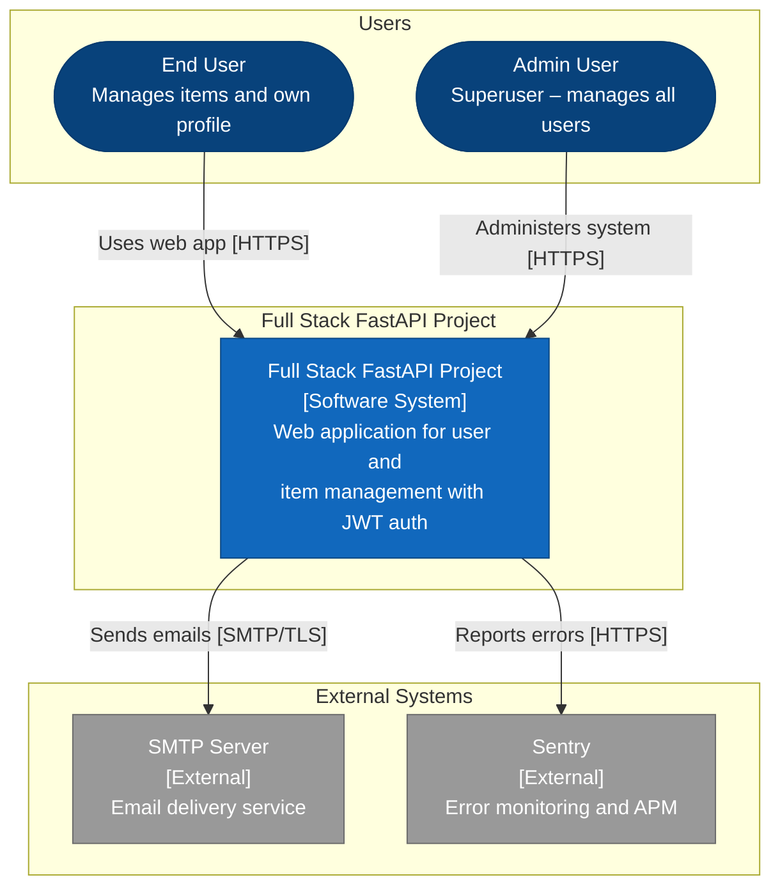
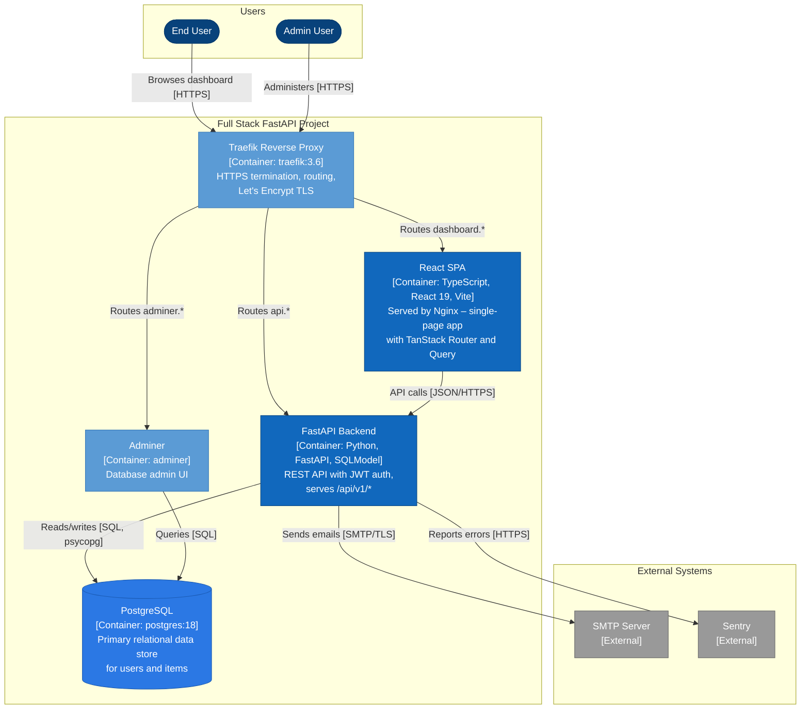
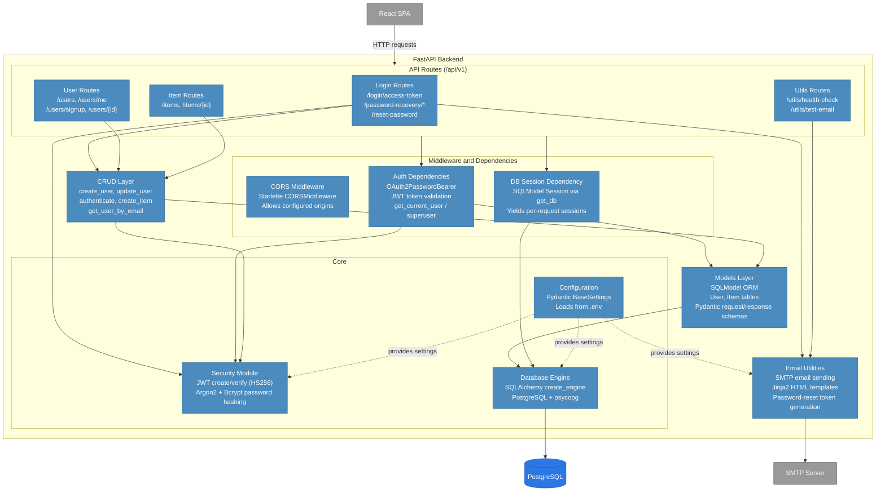
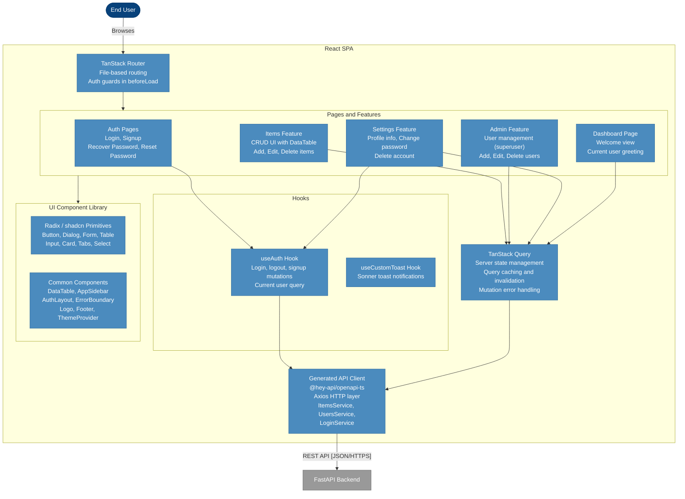

# C4 Architecture Model – Full Stack FastAPI Project

> Auto-generated C4 model describing the system at three levels of abstraction.
> Each successive diagram zooms into an element from the level above.

---

## L1: System Context



---

## L2: Container



---

## L3: FastAPI Backend



---

## L3: React SPA



---

## Containment Map

```text
%% ══════════════════════════════════════════════════════════════════
%% CONTAINMENT MAP – every subgraph and its direct children
%% ══════════════════════════════════════════════════════════════════

%% ── L1 top-level groups ─────────────────────────────────────────
users              CONTAINS [user, admin_user]
platform_boundary  CONTAINS [platform]
external           CONTAINS [smtp_server, sentry_ext]

%% ── L2 container-level (platform_boundary expands) ──────────────
platform_boundary  CONTAINS [traefik, spa, fastapi_backend, pg, adminer]
users              CONTAINS [user, admin_user]
external           CONTAINS [smtp_server, sentry_ext]

%% ── L3: fastapi_backend internals ───────────────────────────────
fastapi_backend CONTAINS [routes, middleware, crud_layer, models_layer, core, email_utils]
  routes      CONTAINS [login_routes, user_routes, item_routes, utils_routes]
  middleware  CONTAINS [cors_mw, auth_dep, db_dep]
  core        CONTAINS [security, config, db_engine]

%% ── L3: spa internals ──────────────────────────────────────────
spa CONTAINS [routing, pages, hooks, query_layer, api_client, ui]
  pages CONTAINS [auth_pages, dashboard_page, items_feature, admin_feature, settings_feature]
  hooks CONTAINS [auth_hook, toast_hook]
  ui    CONTAINS [ui_primitives, common_components]
```
