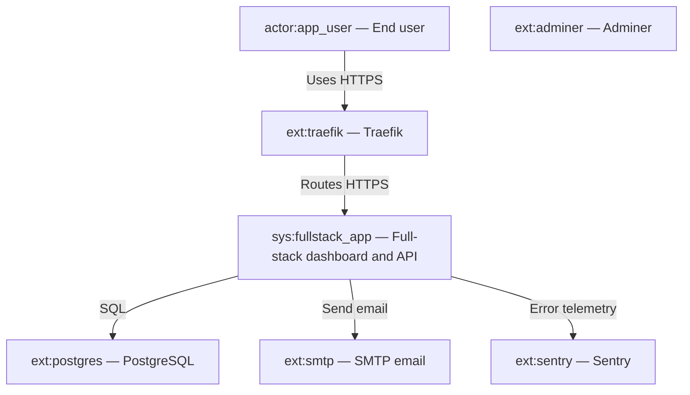
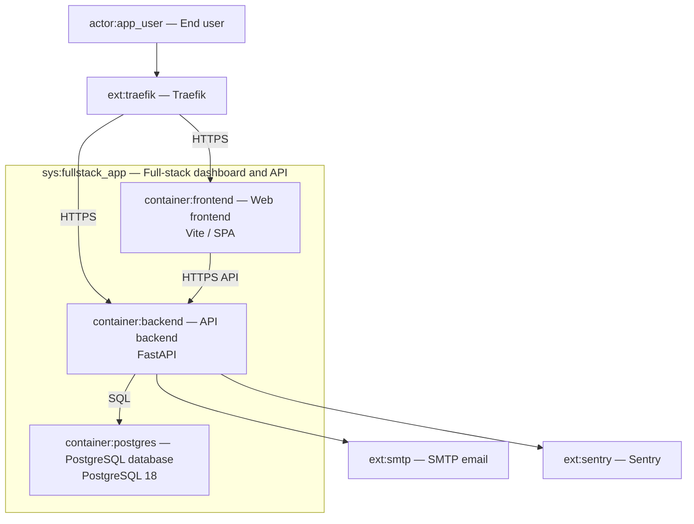
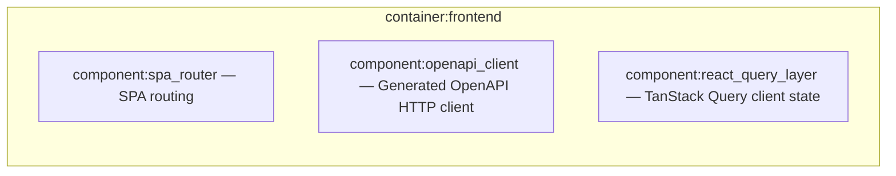
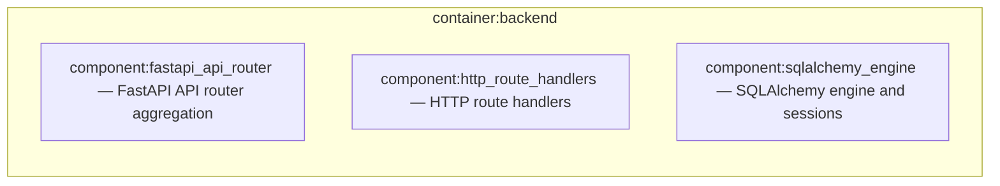
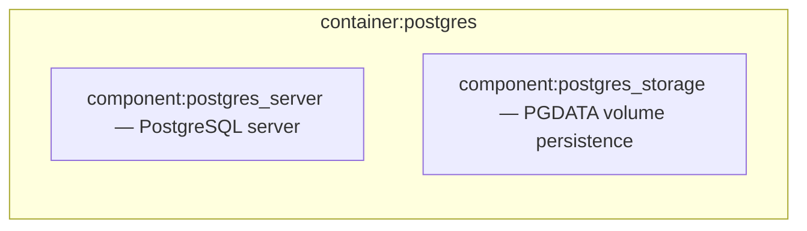
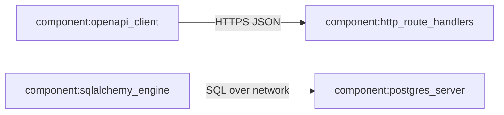

# C4 Architecture

## System Context (L1)



## Container (L2)



## Components — Web frontend (L3)

%% SCOPE: urn:c4:container:container:frontend



## Components — API backend (L3)

%% SCOPE: urn:c4:container:container:backend



## Components — PostgreSQL database (L3)

%% SCOPE: urn:c4:container:container:postgres



## Cross-container component relations (from stream)



## Containment Map

```json
{
  "parentToChildren": {
    "sys_fullstack_app": ["ctn_frontend", "ctn_backend", "ctn_postgres"],
    "ctn_frontend": ["comp_spa_router", "comp_openapi_client", "comp_react_query"],
    "ctn_backend": ["comp_fastapi_router", "comp_http_handlers", "comp_sqlalchemy"],
    "ctn_postgres": ["comp_pg_server", "comp_pg_storage"]
  },
  "childToParent": {
    "ctn_frontend": "sys_fullstack_app",
    "ctn_backend": "sys_fullstack_app",
    "ctn_postgres": "sys_fullstack_app",
    "comp_spa_router": "ctn_frontend",
    "comp_openapi_client": "ctn_frontend",
    "comp_react_query": "ctn_frontend",
    "comp_fastapi_router": "ctn_backend",
    "comp_http_handlers": "ctn_backend",
    "comp_sqlalchemy": "ctn_backend",
    "comp_pg_server": "ctn_postgres",
    "comp_pg_storage": "ctn_postgres"
  }
}
```
