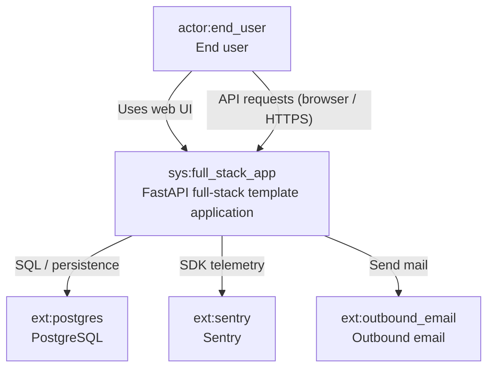
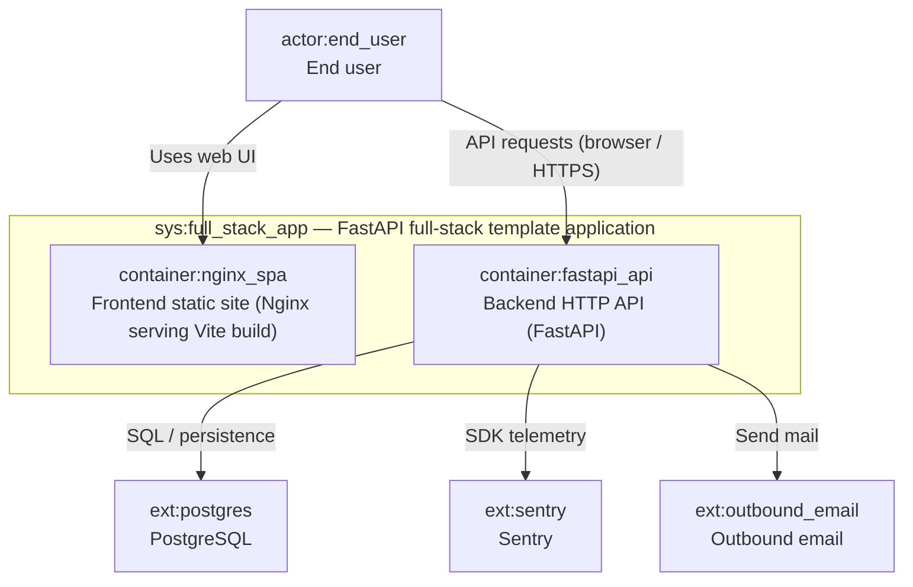
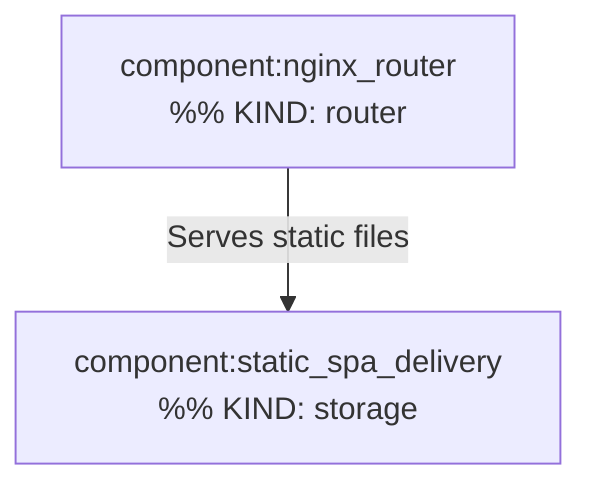
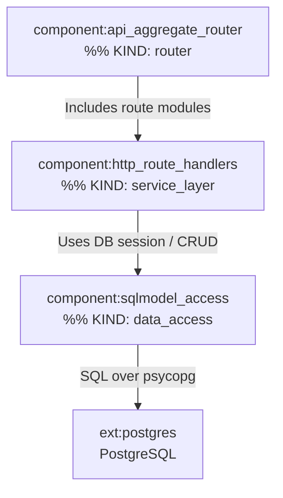

# C4 Architecture

Projected from `docs/c4-events.ndjson` (append-only stream). System label refined in Pass 4.

## L1 — System context



## L2 — Containers



## L3 — container:nginx_spa



## L3 — container:fastapi_api



## Containment Map

```json
{
  "parentToChildren": {
    "full_stack_app": ["nginx_spa", "fastapi_api"],
    "nginx_spa": ["nginx_router", "static_spa_delivery"],
    "fastapi_api": ["api_aggregate_router", "http_route_handlers", "sqlmodel_access"]
  },
  "childToParent": {
    "nginx_spa": "full_stack_app",
    "fastapi_api": "full_stack_app",
    "nginx_router": "nginx_spa",
    "static_spa_delivery": "nginx_spa",
    "api_aggregate_router": "fastapi_api",
    "http_route_handlers": "fastapi_api",
    "sqlmodel_access": "fastapi_api"
  }
}
```
