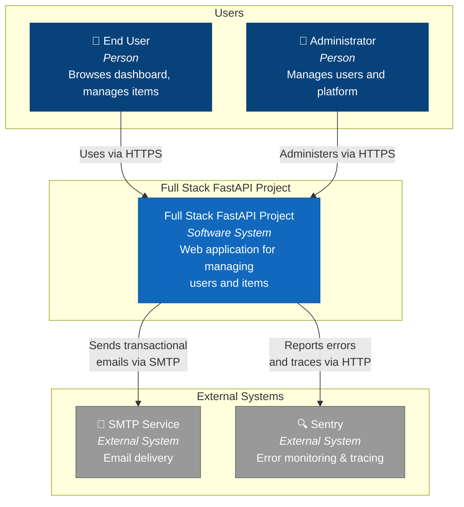
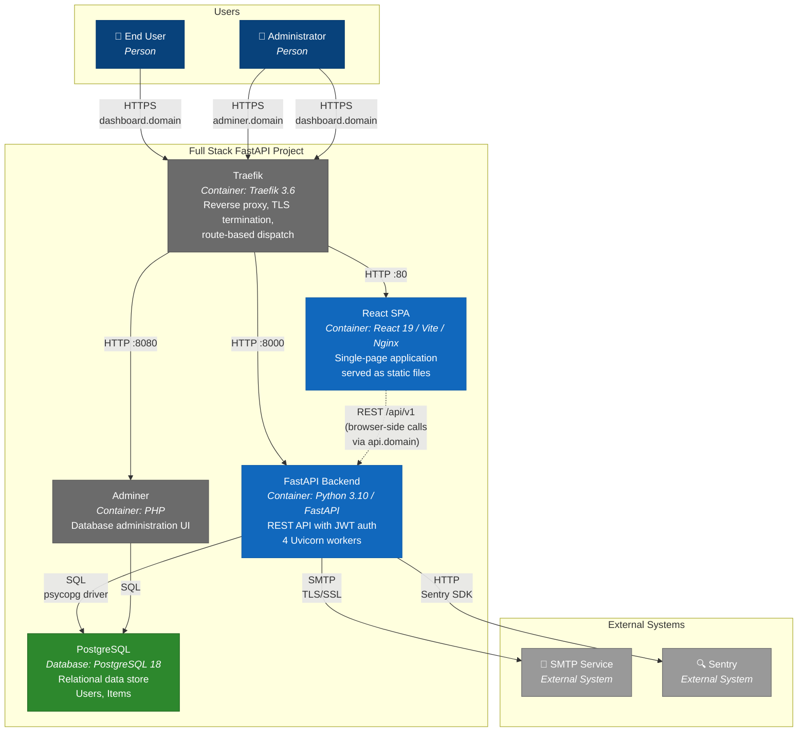
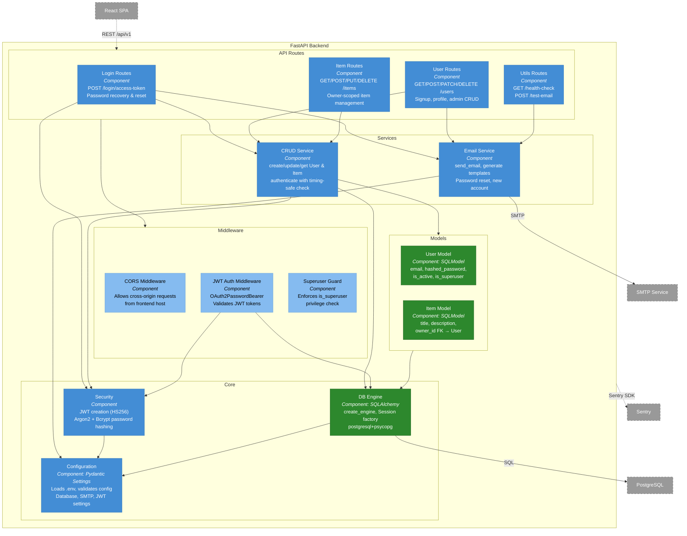
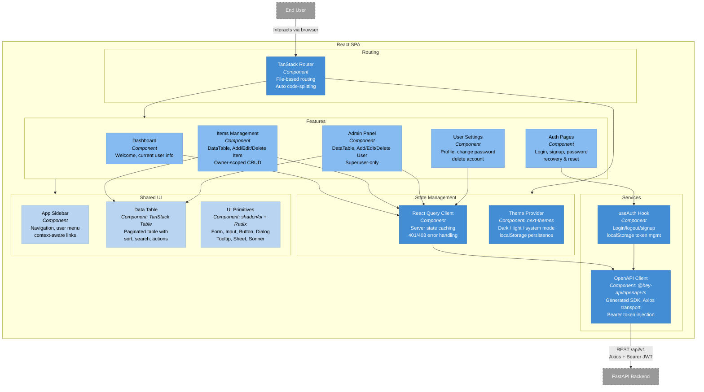
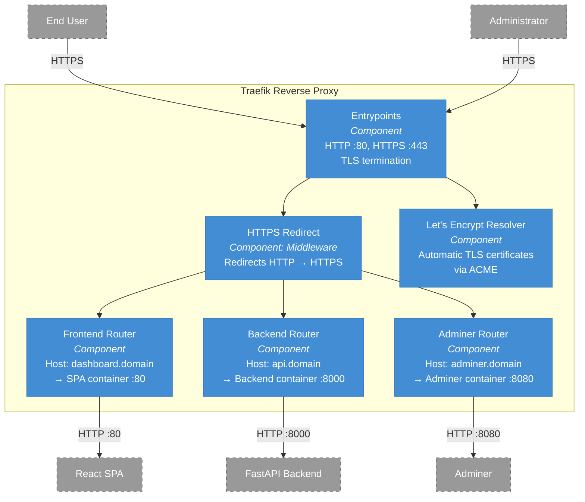

# C4 Architecture Model — Full Stack FastAPI Project

## L1: System Context



---

## L2: Container



---

## L3: FastAPI Backend



---

## L3: React SPA



---

## L3: Traefik Reverse Proxy



---

## Containment Map

```text
%% ═══════════════════════════════════════════════════════════════════
%% CONTAINMENT MAP — Full Stack FastAPI Project
%% Covers L1, L2, and all L3 diagrams
%% ═══════════════════════════════════════════════════════════════════

%% ── L1 top-level groups ─────────────────────────────────────────
users                CONTAINS [end_user, admin_user]
fullstack_boundary   CONTAINS [traefik, spa, fastapi_backend, pg, adminer]
external             CONTAINS [smtp_service, sentry]

%% ── L2→L3 internal containment ──────────────────────────────────

%% FastAPI Backend (L3: fastapi-backend)
fastapi_backend CONTAINS [mw, routes, services, core, models_layer]
  mw             CONTAINS [cors_mw, auth_mw, superuser_guard]
  routes         CONTAINS [login_routes, user_routes, item_routes, utils_routes]
  services       CONTAINS [crud_service, email_service]
  core           CONTAINS [config_module, security_module, db_engine]
  models_layer   CONTAINS [user_model, item_model]

%% React SPA (L3: spa)
spa CONTAINS [routing, state_mgmt, features, services_layer, shared_ui]
  routing        CONTAINS [tanstack_router]
  state_mgmt     CONTAINS [query_client, theme_context]
  features       CONTAINS [dashboard_page, items_feature, admin_feature, settings_feature, auth_feature]
  services_layer CONTAINS [api_client, auth_hook]
  shared_ui      CONTAINS [sidebar_component, data_table, ui_primitives]

%% Traefik Reverse Proxy (L3: traefik)
traefik CONTAINS [entrypoints, https_redirect, frontend_router, backend_router, adminer_router, cert_resolver]
```
