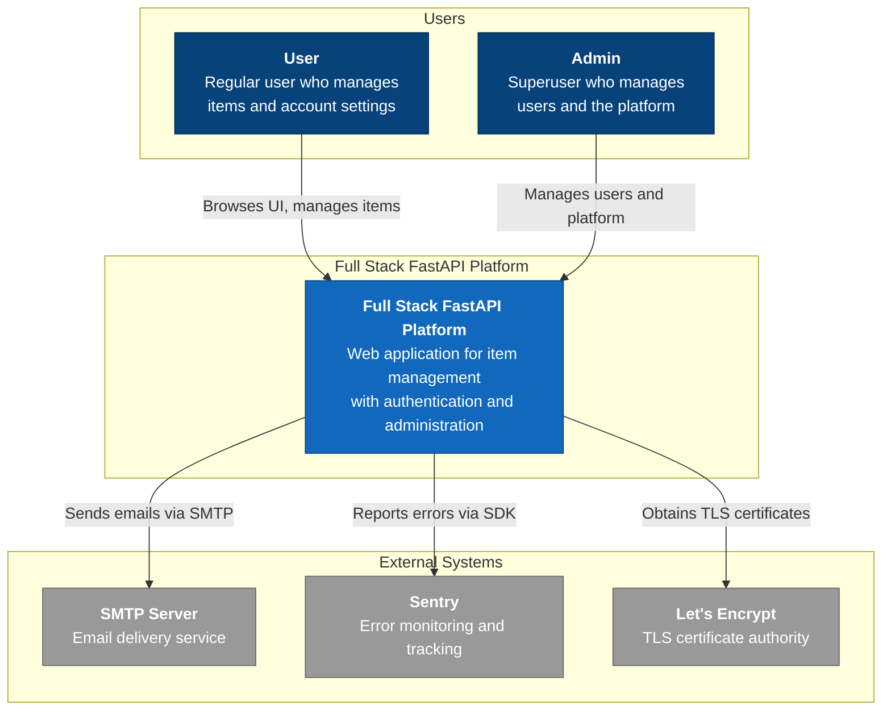
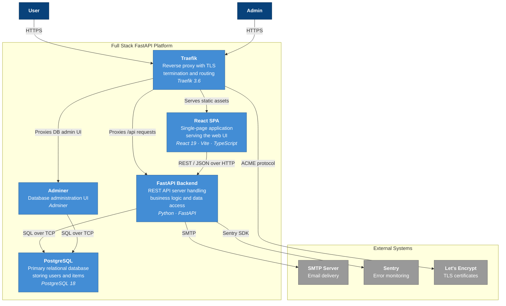
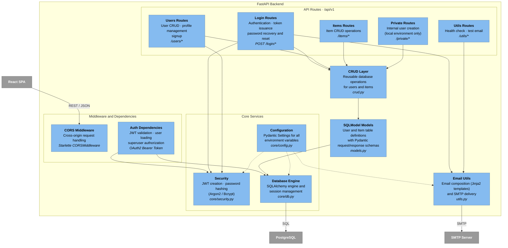
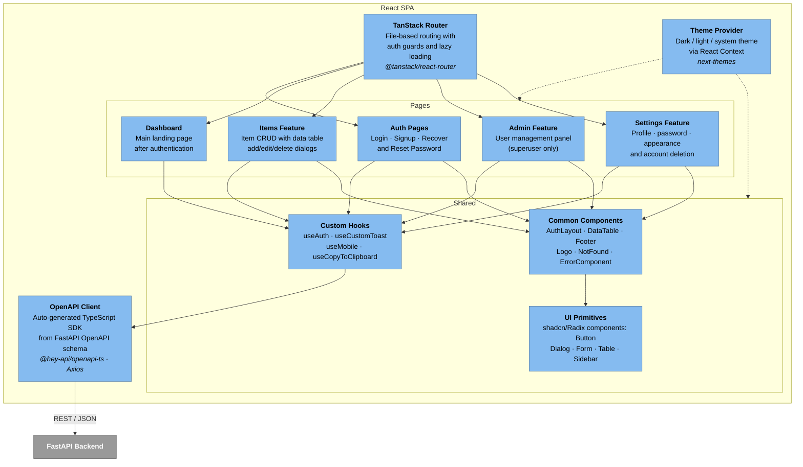

# C4 Architecture Model — Full Stack FastAPI Platform

> Auto-generated C4 model covering L1 (System Context), L2 (Container),
> and L3 (Component) diagrams for the Full Stack FastAPI Platform.

---

## L1: System Context



---

## L2: Container



---

## L3: FastAPI Backend



---

## L3: React SPA



---

## Containment Map

```text
%% ── CONTAINMENT MAP ──────────────────────────────────────────────
%%
%% Every subgraph from every diagram is listed.
%% Nesting is expressed by indentation.
%%
%% ── L1 top-level groups ─────────────────────────────────────────
%% users              CONTAINS [user, admin_user]
%% platform_boundary  CONTAINS [platform]
%% external           CONTAINS [smtp, sentry, letsencrypt]
%%
%% ── L2 top-level groups ─────────────────────────────────────────
%% platform_boundary  CONTAINS [traefik, spa, fastapi, pg, adminer]
%% external           CONTAINS [smtp, sentry, letsencrypt]
%%
%% ── L3: FastAPI Backend (urn:c4:container:fastapi) ──────────────
%% fastapi            CONTAINS [mw, routes, crud_layer, models_layer, core, email_utils]
%%   mw               CONTAINS [cors_mw, auth_deps]
%%   routes           CONTAINS [login_routes, users_routes, items_routes, utils_routes, private_routes]
%%   core             CONTAINS [core_config, core_security, core_db]
%%
%% ── L3: React SPA (urn:c4:container:spa) ────────────────────────
%% spa                CONTAINS [router, pages, shared, api_client, theme_provider]
%%   pages            CONTAINS [auth_pages, dashboard_page, items_feature, admin_feature, settings_feature]
%%   shared           CONTAINS [common_components, ui_primitives, hooks_layer]
```
