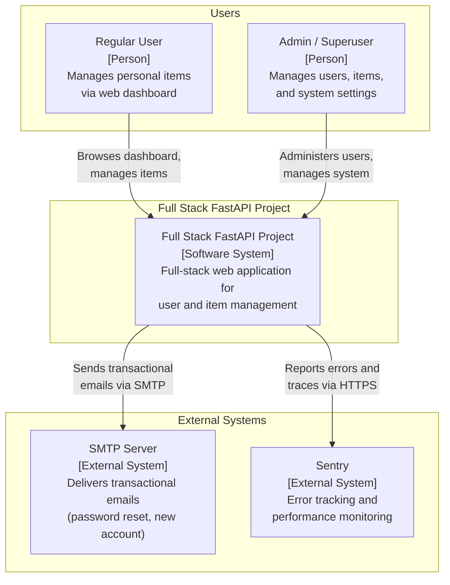
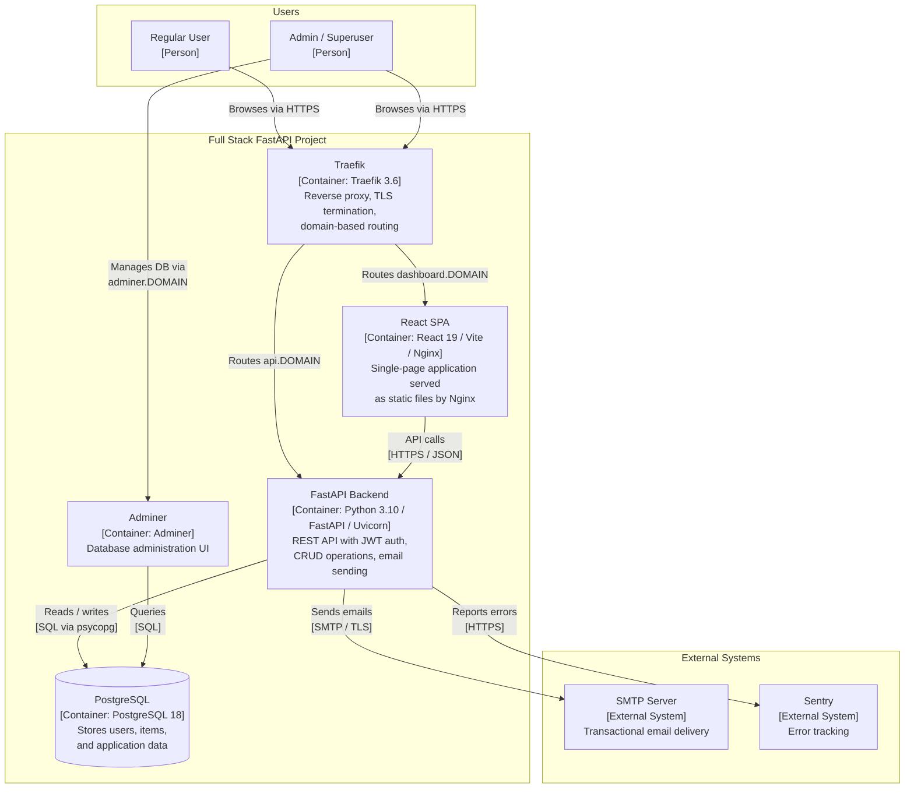
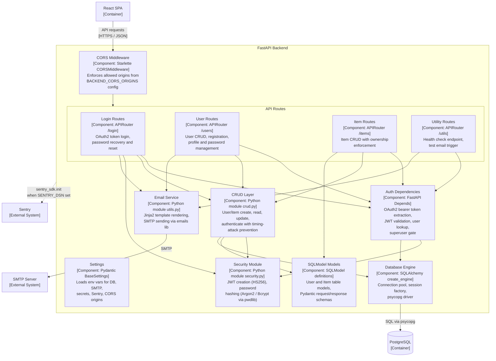
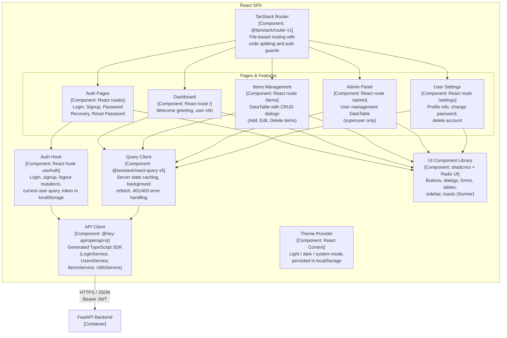

# C4 Architecture Model – Full Stack FastAPI Project

> Auto-generated from source code analysis. Evidence drawn exclusively from
> source files, Docker/Compose configs, CI definitions, and runtime configuration.

---

## L1: System Context



---

## L2: Container



---

## L3: FastAPI Backend



---

## L3: React SPA



---

## Containment Map

```text
%% ═══════════════════════════════════════════════════════════════
%% CONTAINMENT MAP – Full Stack FastAPI Project
%% Covers L1, L2, and all L3 diagrams.
%% Format: <subgraph_id> CONTAINS [<child_id>, ...]
%% Indentation shows nesting depth.
%% ═══════════════════════════════════════════════════════════════

%% ── L1 top-level groups ─────────────────────────────────────────
users              CONTAINS [user, admin_user]
system_boundary    CONTAINS [traefik, spa, fastapi_backend, pg, adminer]
external           CONTAINS [smtp, sentry]

%% ── L2→L3 internal containment: FastAPI Backend ─────────────────
fastapi_backend    CONTAINS [cors_mw, auth_deps, config_mod, routes, crud_layer, security_mod, email_svc, db_engine, models_layer]
  routes           CONTAINS [login_routes, user_routes, item_routes, util_routes]

%% ── L2→L3 internal containment: React SPA ──────────────────────
spa                CONTAINS [router, query_client, auth_hook, api_client, theme_provider, pages, ui_components]
  pages            CONTAINS [auth_pages, dashboard_page, items_feature, admin_feature, settings_feature]
```
