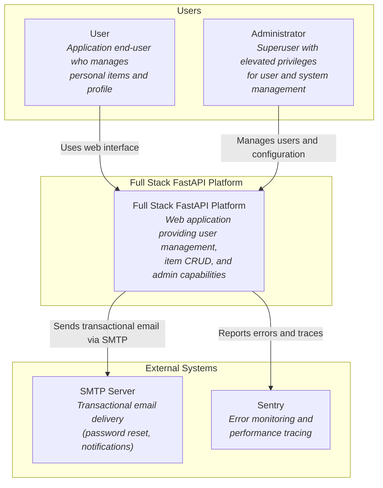
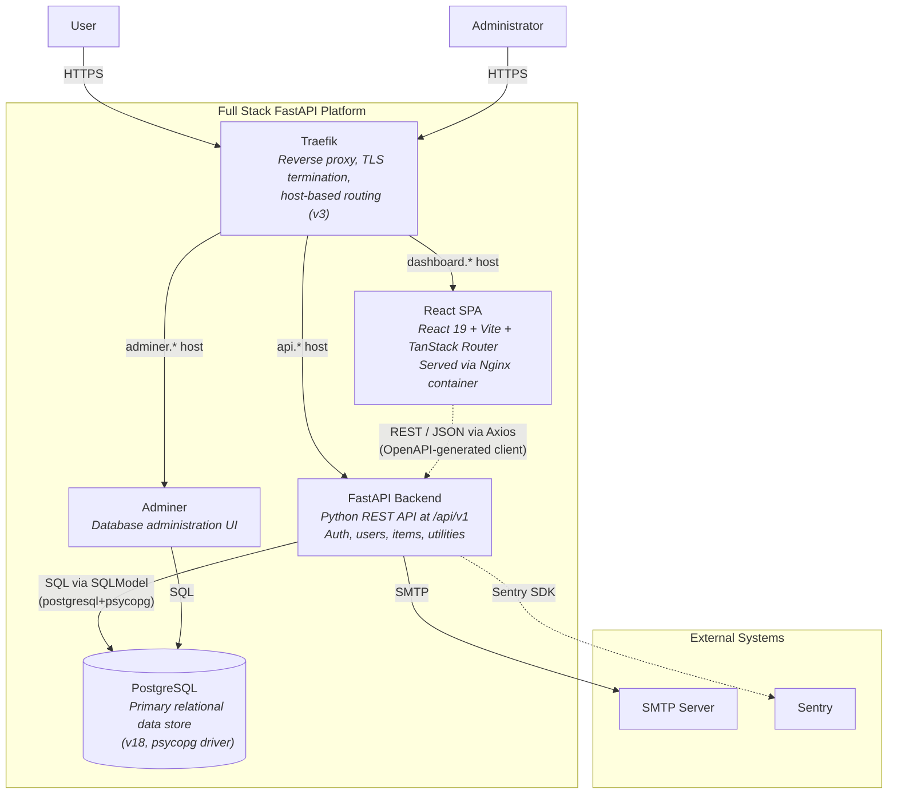
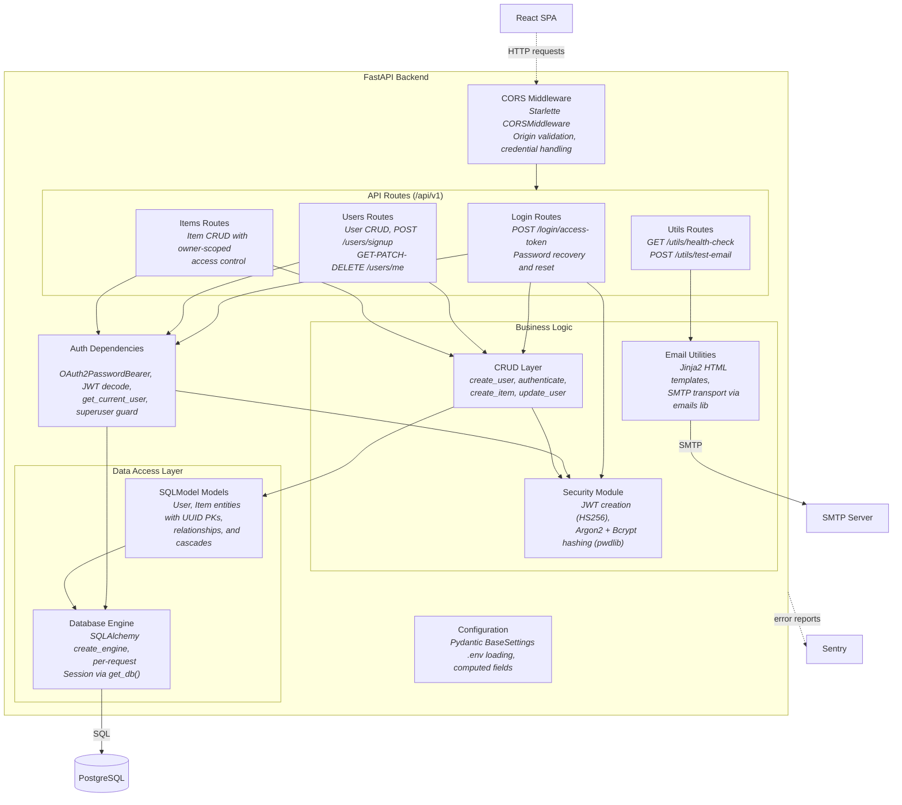
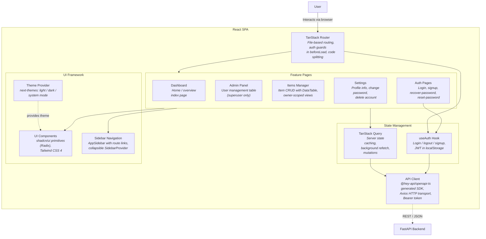

# C4 Architecture — Full Stack FastAPI Project

> Auto-generated C4 architecture model.
> Diagrams follow the C4 hierarchy: L1 System Context → L2 Container → L3 Component.

---

## L1: System Context



---

## L2: Container Diagram



---

## L3: FastAPI Backend



---

## L3: React SPA



---

## Containment Map

```text
%% ═══════════════════════════════════════════════════════════════
%% CONTAINMENT MAP — Full Stack FastAPI Platform
%% ═══════════════════════════════════════════════════════════════

%% ── L1 top-level groups ─────────────────────────────────────────
users              CONTAINS [user, admin_user]
fullstack_boundary CONTAINS [fullstack_system, traefik, spa, fastapi_api, pg, adminer]
external           CONTAINS [smtp, sentry]

%% ── L2→L3 internal containment: FastAPI Backend ─────────────────
fastapi_api CONTAINS [cors_mw, routes, auth_deps, services, data, config]
  routes    CONTAINS [login_routes, users_routes, items_routes, utils_routes]
  services  CONTAINS [crud_layer, security_mod, email_utils]
  data      CONTAINS [models_layer, db_engine]

%% ── L2→L3 internal containment: React SPA ──────────────────────
spa CONTAINS [tanstack_router, state_mgmt, api_client, features, ui_framework]
  state_mgmt   CONTAINS [auth_hook, query_layer]
  features     CONTAINS [dashboard_feature, admin_feature, items_feature, settings_feature, auth_pages]
  ui_framework CONTAINS [ui_lib, theme_provider, sidebar_nav]
```
