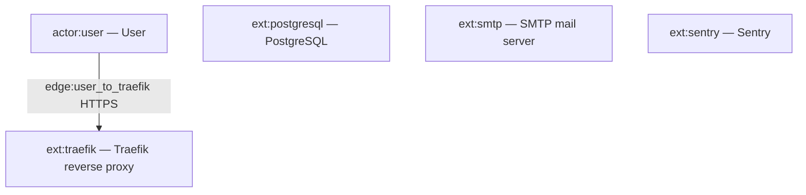
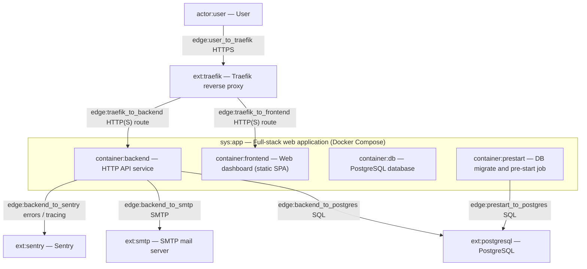
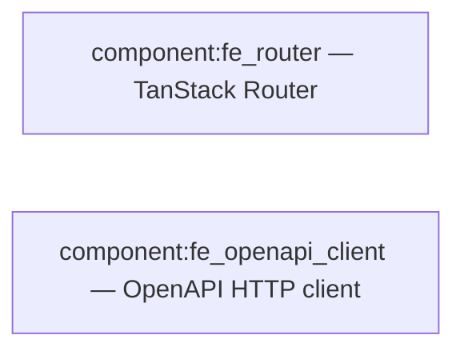
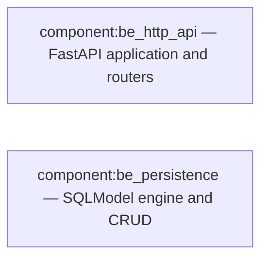
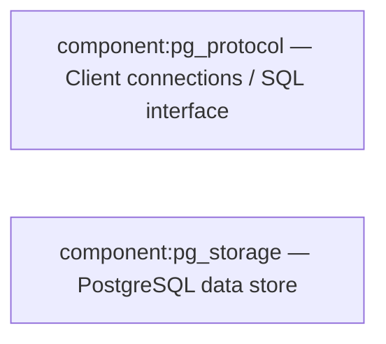
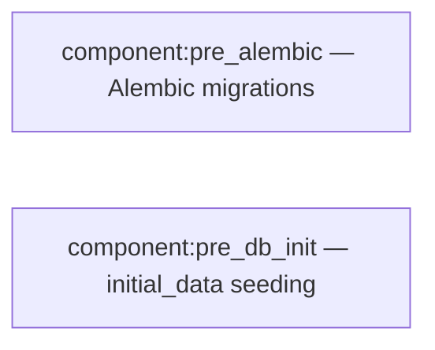

# C4 Architecture

Projections from `docs/c4-events.ndjson` (Pass 4 frozen). Refined system label: **sys:app** — Full-stack web application (Docker Compose).

## L1 — System context

## L2 — Containers

## L3 — Components (selected containers)

### container:frontend

### container:backend

_Stream edges (from frozen stream):_ `edge:l3_fe_client_to_be_api` (component:fe_openapi_client → component:be_http_api); `edge:l3_be_persistence_to_pg` (component:be_persistence → component:pg_storage).

### container:db

### container:prestart

## Containment map

| Parent | Child | Child type |
|--------|-------|------------|
| sys:app | container:frontend | container |
| sys:app | container:backend | container |
| sys:app | container:db | container |
| sys:app | container:prestart | container |
| container:frontend | component:fe_router | component (router) |
| container:frontend | component:fe_openapi_client | component (integration) |
| container:backend | component:be_http_api | component (boundary) |
| container:backend | component:be_persistence | component (data_access) |
| container:db | component:pg_protocol | component (boundary) |
| container:db | component:pg_storage | component (storage) |
| container:prestart | component:pre_alembic | component (pipeline) |
| container:prestart | component:pre_db_init | component (worker) |
