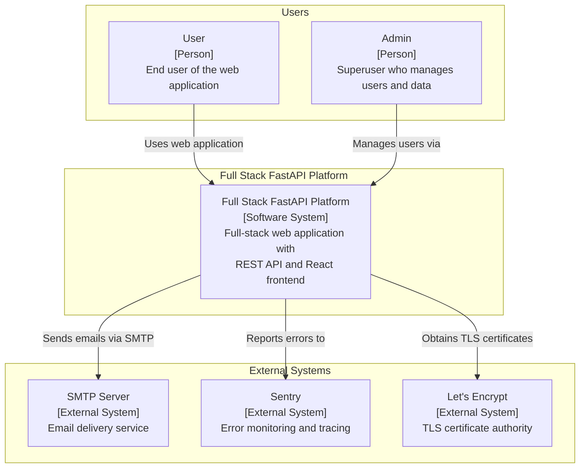
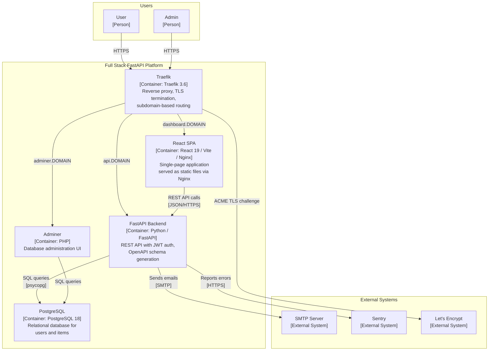
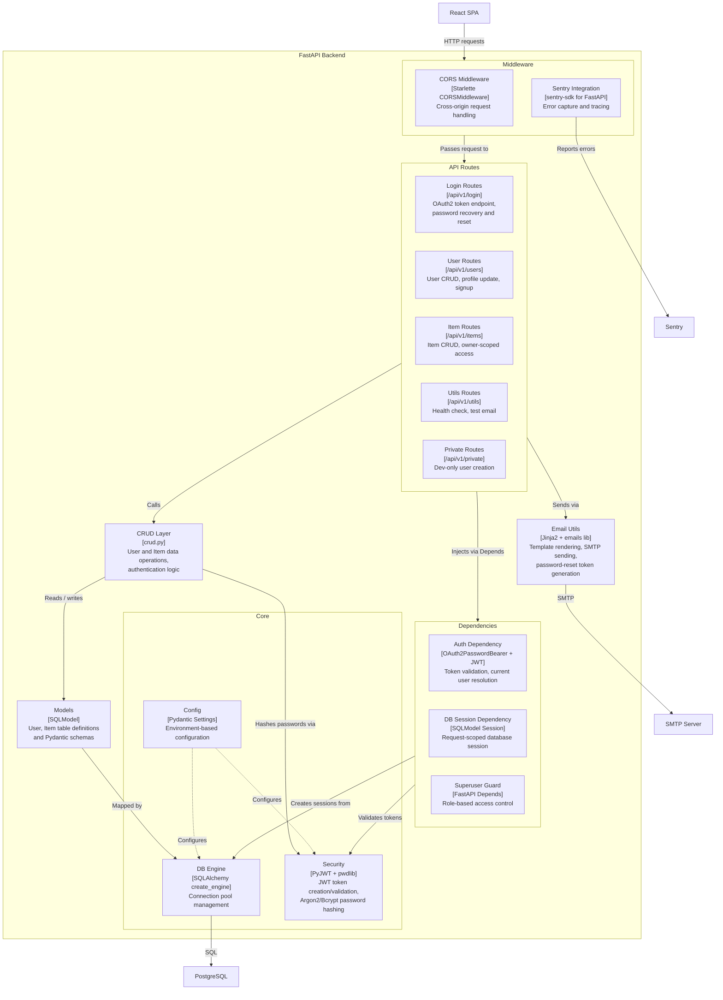
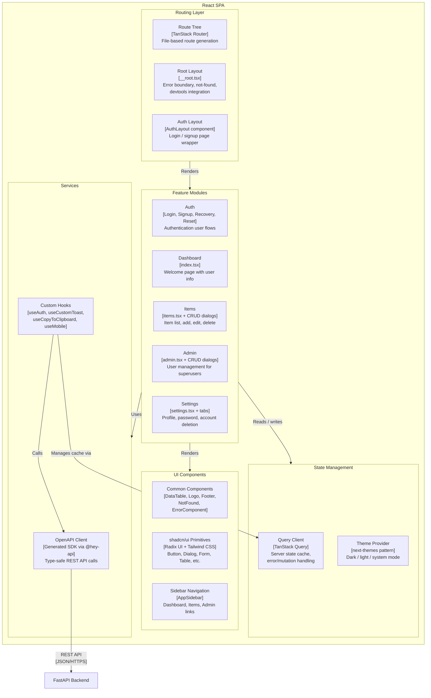

# C4 Architecture — Full Stack FastAPI Platform

> Auto-generated C4 model for the Full Stack FastAPI Project.
> Each diagram follows [C4 model](https://c4model.com/) layering conventions.

---

## L1: System Context



---

## L2: Container



---

## L3: FastAPI Backend



---

## L3: React SPA



---

## Containment Map

```text
%% ── L1 top-level groups ─────────────────────────────────────────
users              CONTAINS [user, admin_user]
platform_boundary  CONTAINS [traefik, spa, fastapi, pg, adminer]
external_systems   CONTAINS [smtp, sentry, letsencrypt]

%% ── L2→L3 internal containment ──────────────────────────────────
fastapi CONTAINS [middleware, routes, deps, crud, core, models, email_utils]
  middleware CONTAINS [cors_mw, sentry_mw]
  routes     CONTAINS [login_routes, user_routes, item_routes, util_routes, private_routes]
  deps       CONTAINS [auth_dep, db_dep, superuser_dep]
  core       CONTAINS [config, db_engine, security]

spa CONTAINS [routing, features, services_layer, ui_layer, state]
  routing        CONTAINS [route_tree, root_layout, auth_layout]
  features       CONTAINS [auth_feature, dashboard_feature, items_feature, admin_feature, settings_feature]
  services_layer CONTAINS [api_client, hooks_layer]
  ui_layer       CONTAINS [common_components, shadcn_ui, sidebar_component]
  state          CONTAINS [query_client, theme_provider]
```
