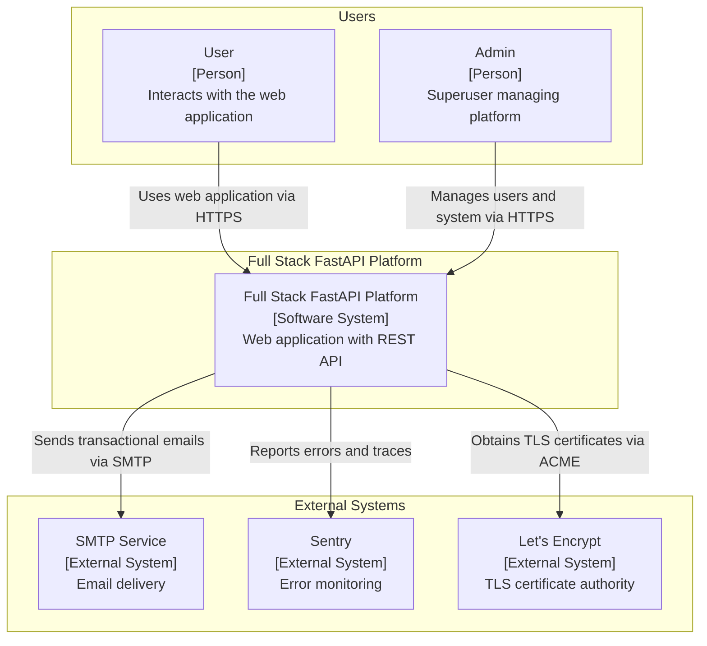
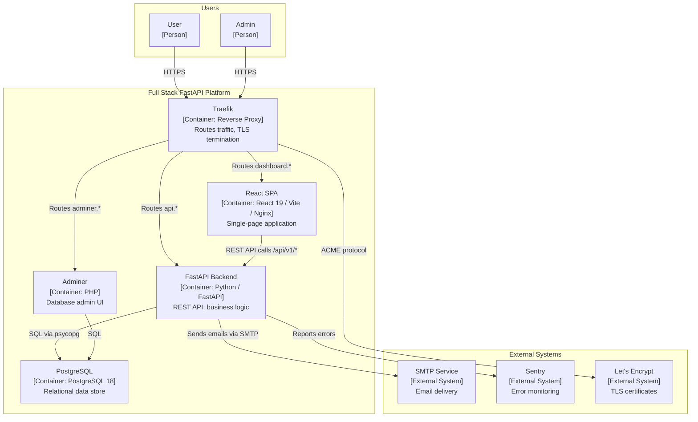
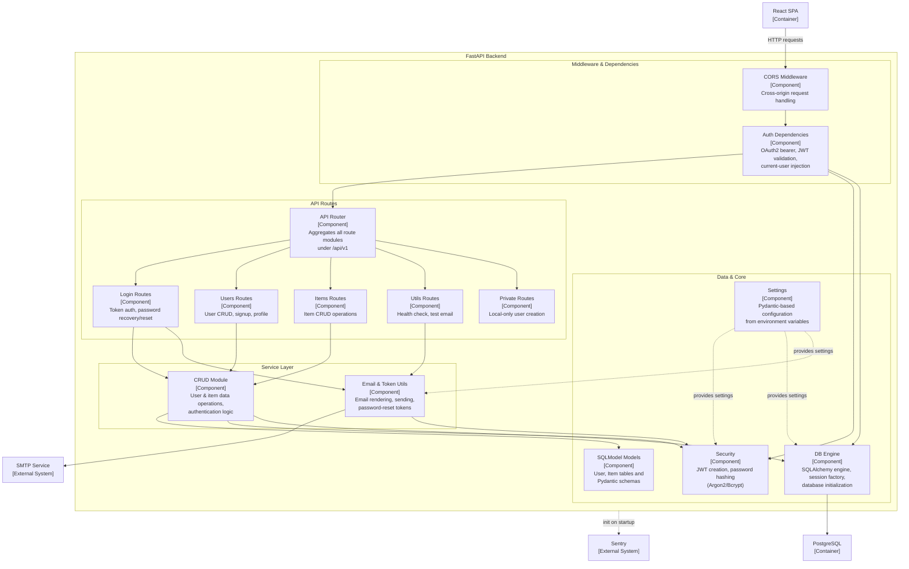
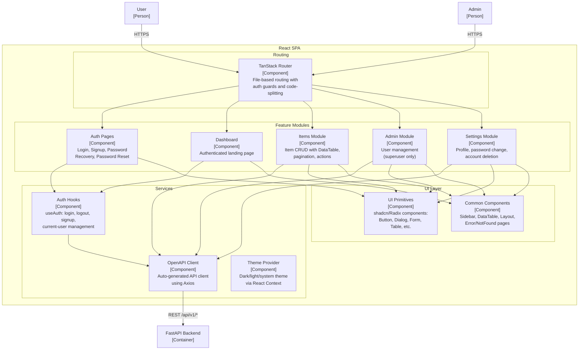
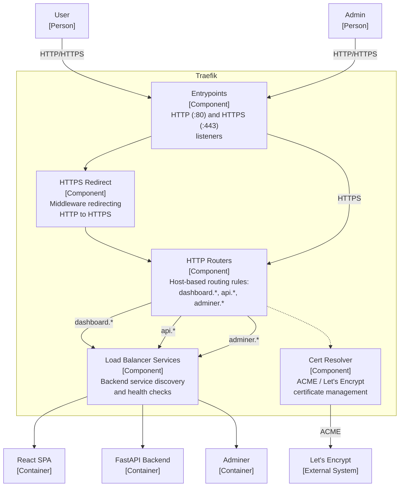

# C4 Architecture Model — Full Stack FastAPI Platform

---

## L1: System Context



---

## L2: Container Diagram



---

## L3: FastAPI Backend



---

## L3: React SPA



---

## L3: Traefik



---

## Containment Map

```text
%% ══════════════════════════════════════════════════════════════════
%% CONTAINMENT MAP — Full Stack FastAPI Platform
%% Every subgraph and its children across L1, L2, and L3.
%% ══════════════════════════════════════════════════════════════════

%% ── L1 top-level groups ────────────────────────────────────────────
users              CONTAINS [user, admin_user]
platform_boundary  CONTAINS [spa, fastapi, pg, traefik, adminer]
external           CONTAINS [smtp, sentry, letsencrypt]

%% ── L2 containers (same as platform_boundary at L1) ───────────────
%% platform_boundary is zoomed into at L2 revealing:
%%   spa, fastapi, pg, traefik, adminer

%% ── L3: FastAPI Backend (urn:c4:container:fastapi) ─────────────────
fastapi            CONTAINS [mw, routes, services, data_layer]
  mw               CONTAINS [cors_mw, auth_deps]
  routes            CONTAINS [api_router, login_routes, users_routes, items_routes, utils_routes, private_routes]
  services          CONTAINS [crud_layer, email_utils]
  data_layer        CONTAINS [models_layer, db_layer, security, config]

%% ── L3: React SPA (urn:c4:container:spa) ───────────────────────────
spa                CONTAINS [routing_layer, services_layer, features, ui_layer]
  routing_layer    CONTAINS [routing]
  services_layer   CONTAINS [api_client, auth_hooks, theme_provider]
  features         CONTAINS [auth_pages, dashboard_feature, items_feature, admin_feature, settings_feature]
  ui_layer         CONTAINS [ui_primitives, common_components]

%% ── L3: Traefik (urn:c4:container:traefik) ─────────────────────────
traefik            CONTAINS [entrypoints, http_routers, https_redirect, cert_resolver, lb_services]
```
