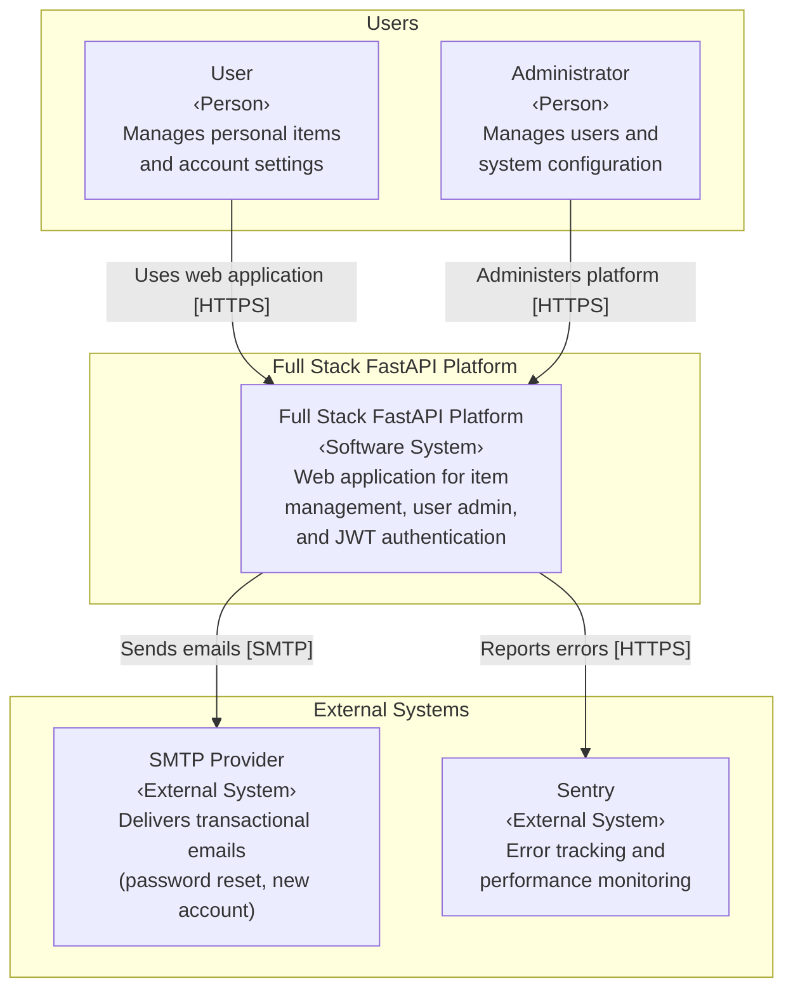
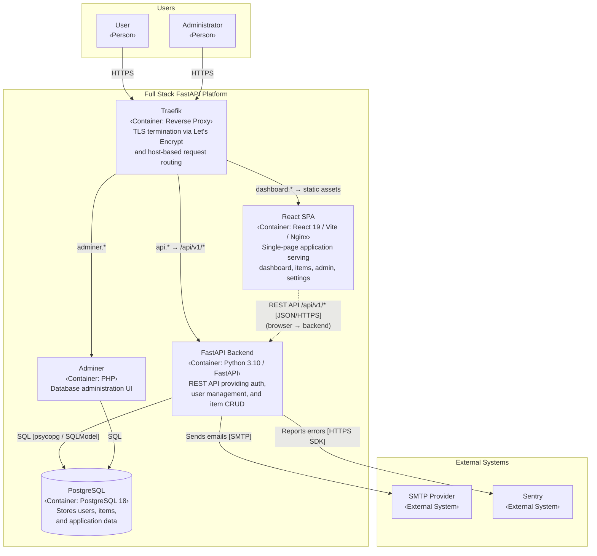
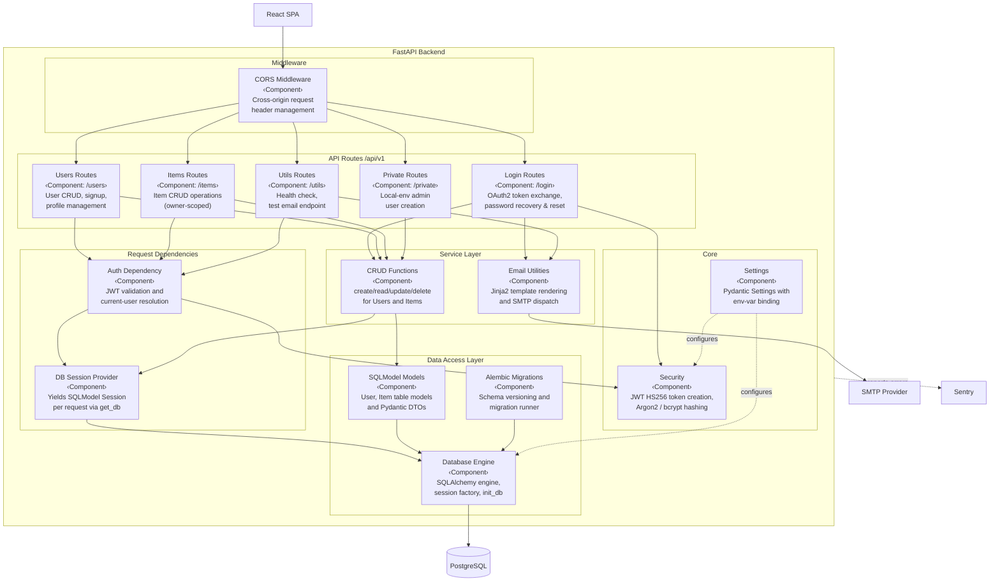
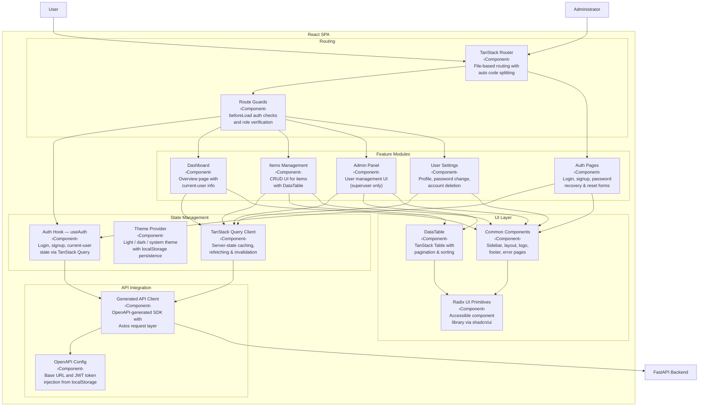

# C4 Architecture Model — Full Stack FastAPI Platform

> C4 model: L1 System Context · L2 Container · L3 Component diagrams.
> Generated from source analysis of the full-stack-fastapi-template codebase.

---

## L1: System Context



---

## L2: Container



---

## L3: FastAPI Backend



---

## L3: React SPA



---

## Containment Map

```text
%% ══════════════════════════════════════════════════════════════════
%% CONTAINMENT MAP — Full Stack FastAPI Platform
%% Covers L1, L2, and all L3 diagrams.
%% Every subgraph from every diagram appears as a CONTAINS entry.
%% ══════════════════════════════════════════════════════════════════

%% ── L1 top-level groups ─────────────────────────────────────────
users                     CONTAINS [user, admin_user]
fastapi_platform_boundary CONTAINS [fastapi_platform]
external                  CONTAINS [smtp_service, sentry]

%% ── L2 internal containment ─────────────────────────────────────
fastapi_platform CONTAINS [traefik, spa, fastapi_backend, pg, adminer]

%% ── L3: FastAPI Backend ─────────────────────────────────────────
fastapi_backend CONTAINS [mw, routes, deps, services, data, core]
  mw            CONTAINS [cors_mw]
  routes        CONTAINS [login_routes, users_routes, items_routes, utils_routes, private_routes]
  deps          CONTAINS [auth_dep, session_dep]
  services      CONTAINS [crud_layer, email_utils]
  data          CONTAINS [models_layer, db_engine, alembic_migrations]
  core          CONTAINS [app_config, jwt_security]

%% ── L3: React SPA ──────────────────────────────────────────────
spa CONTAINS [routing, state, api_layer, features, ui_layer]
  routing       CONTAINS [ts_router, route_guards]
  state         CONTAINS [auth_hook, theme_ctx, query_client]
  api_layer     CONTAINS [api_client, openapi_config]
  features      CONTAINS [dashboard_feat, items_feat, admin_feat, settings_feat, auth_feat]
  ui_layer      CONTAINS [common_ui, radix_primitives, data_table]
```
