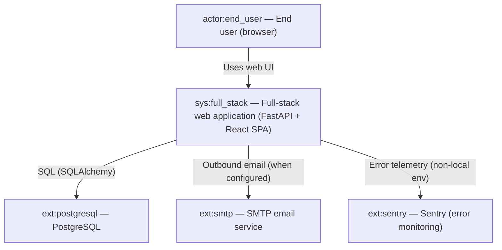
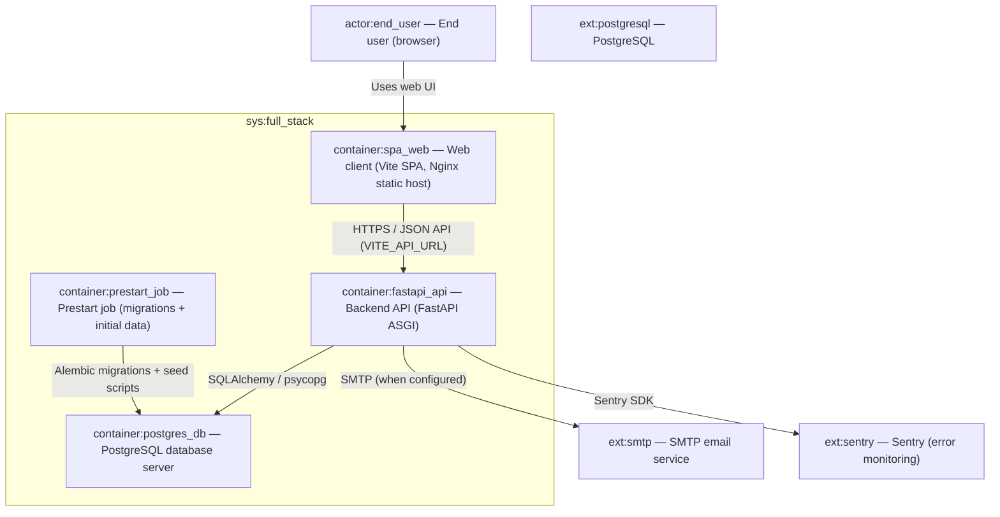
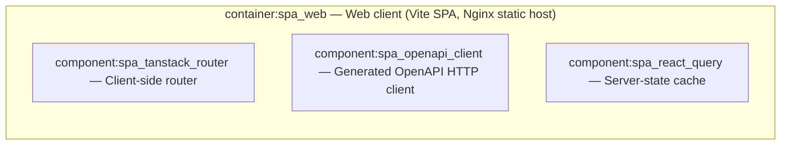
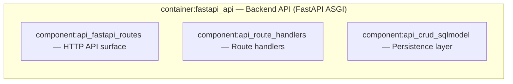
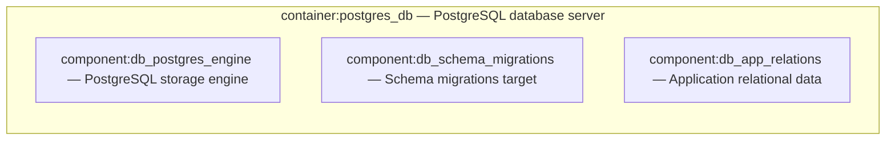
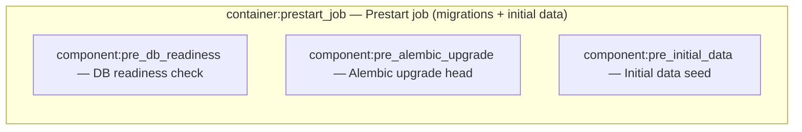

# C4 Architecture

Derived from `docs/c4-events.ndjson` (replay projection). Pass 4 adds no new elements.

## L1 — System Context



## L2 — Container Diagram



## L3 — container:spa_web



## L3 — container:fastapi_api



## L3 — container:postgres_db



## L3 — container:prestart_job



## Containment Map

```json
{
  "parentToChildren": {
    "sys:full_stack": [
      "container:spa_web",
      "container:fastapi_api",
      "container:postgres_db",
      "container:prestart_job"
    ],
    "container:spa_web": [
      "component:spa_tanstack_router",
      "component:spa_openapi_client",
      "component:spa_react_query"
    ],
    "container:fastapi_api": [
      "component:api_fastapi_routes",
      "component:api_route_handlers",
      "component:api_crud_sqlmodel"
    ],
    "container:postgres_db": [
      "component:db_postgres_engine",
      "component:db_schema_migrations",
      "component:db_app_relations"
    ],
    "container:prestart_job": [
      "component:pre_alembic_upgrade",
      "component:pre_initial_data",
      "component:pre_db_readiness"
    ]
  },
  "childToParent": {
    "container:spa_web": "sys:full_stack",
    "container:fastapi_api": "sys:full_stack",
    "container:postgres_db": "sys:full_stack",
    "container:prestart_job": "sys:full_stack",
    "component:spa_tanstack_router": "container:spa_web",
    "component:spa_openapi_client": "container:spa_web",
    "component:spa_react_query": "container:spa_web",
    "component:api_fastapi_routes": "container:fastapi_api",
    "component:api_route_handlers": "container:fastapi_api",
    "component:api_crud_sqlmodel": "container:fastapi_api",
    "component:db_postgres_engine": "container:postgres_db",
    "component:db_schema_migrations": "container:postgres_db",
    "component:db_app_relations": "container:postgres_db",
    "component:pre_alembic_upgrade": "container:prestart_job",
    "component:pre_initial_data": "container:prestart_job",
    "component:pre_db_readiness": "container:prestart_job"
  }
}
```
