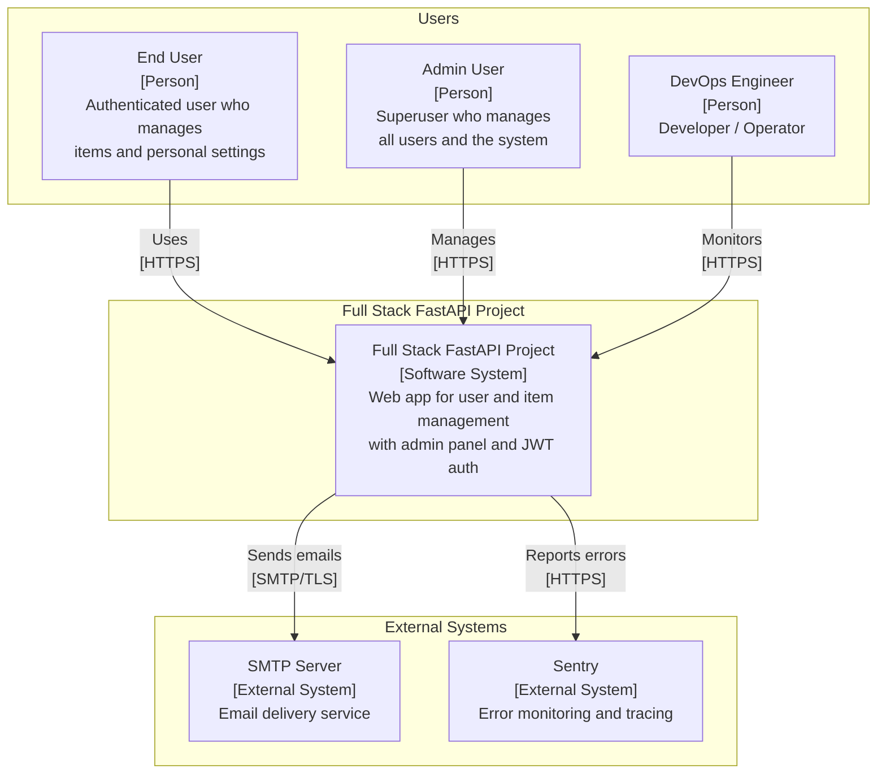
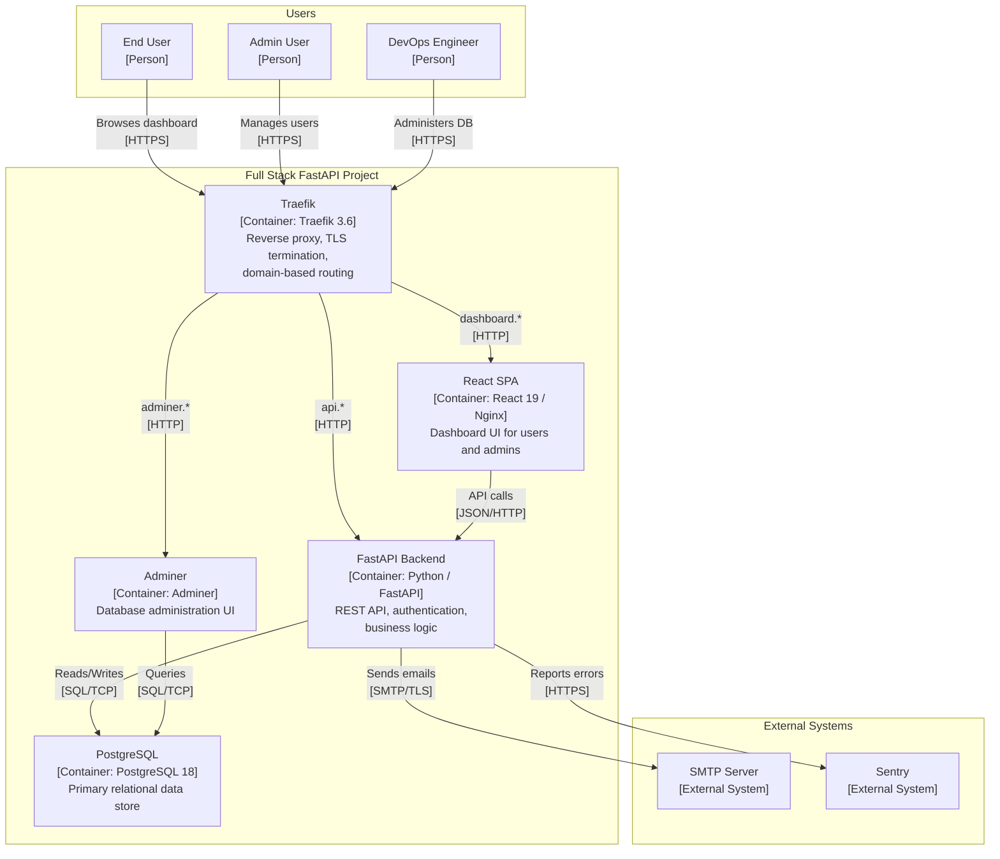
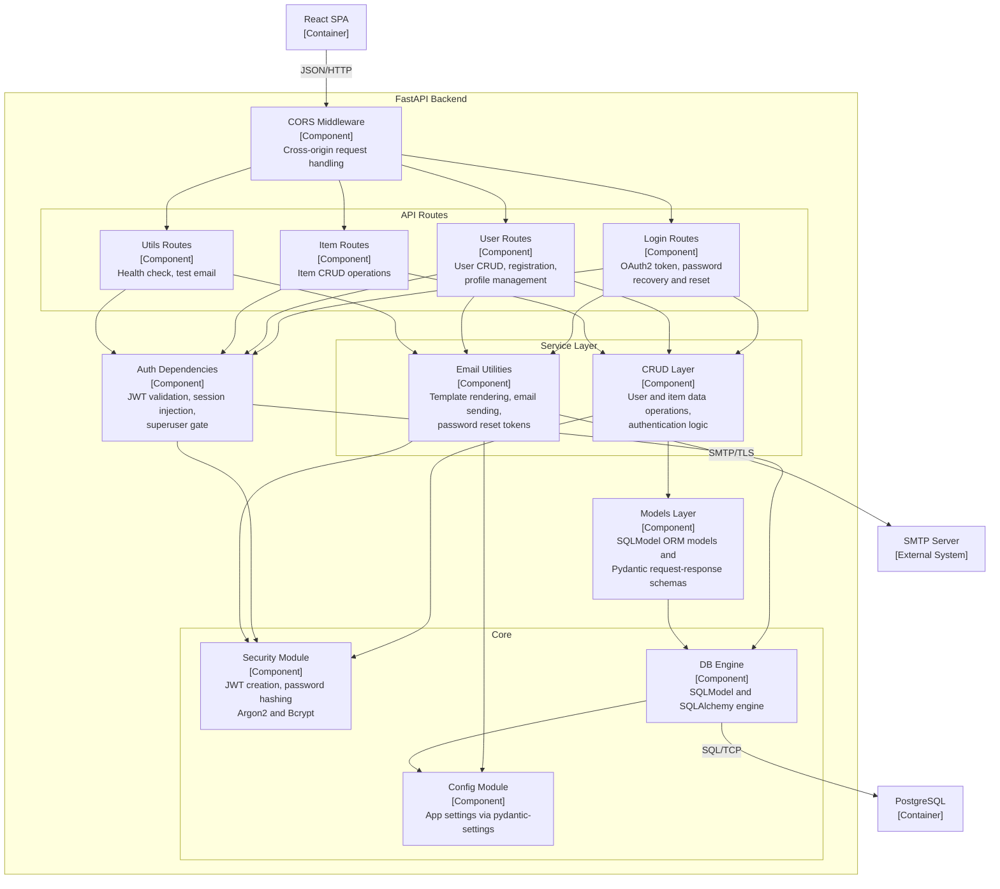
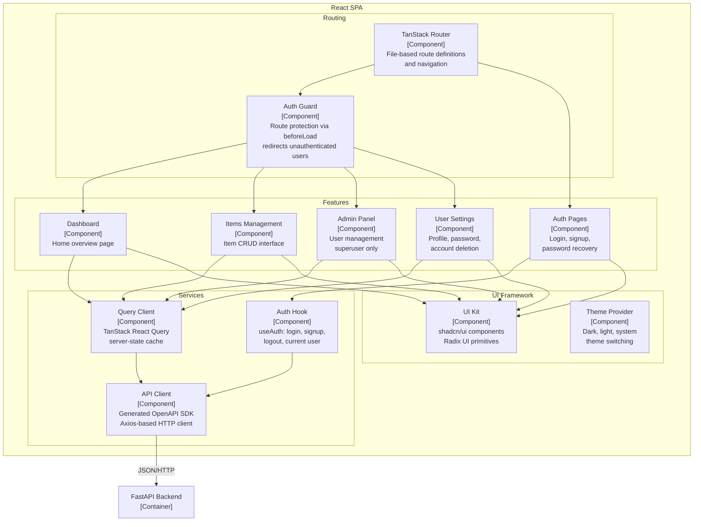

# C4 Architecture — Full Stack FastAPI Project

> C4 model for the **Full Stack FastAPI Project**, a web application for user
> and item management with JWT authentication, admin panel, and email
> notifications. Three levels of zoom: System Context, Container, Component.

---

## L1: System Context

Actors, the software system, and external dependencies.



---

## L2: Container

All deployable units inside the system boundary.



---

## L3: FastAPI Backend

Components inside the FastAPI Backend container.



---

## L3: React SPA

Components inside the React SPA container.



---

## Containment Map

```text
%% ══════════════════════════════════════════════════════════════════
%% CONTAINMENT MAP
%% ══════════════════════════════════════════════════════════════════

%% ── L1 top-level groups ─────────────────────────────────────────
users            CONTAINS [end_user, admin_user, devops]
system_boundary  CONTAINS [traefik, spa, fastapi_backend, pg, adminer]
external         CONTAINS [smtp, sentry]

%% ── L3: FastAPI Backend ─────────────────────────────────────────
fastapi_backend  CONTAINS [cors_mw, auth_deps, routes, services, core, models_layer]
  routes         CONTAINS [login_routes, user_routes, item_routes, utils_routes]
  services       CONTAINS [crud_layer, email_utils]
  core           CONTAINS [security_mod, config_mod, db_engine]

%% ── L3: React SPA ──────────────────────────────────────────────
spa              CONTAINS [spa_routing, spa_features, spa_services, spa_ui]
  spa_routing    CONTAINS [router, auth_guard]
  spa_features   CONTAINS [dashboard_view, items_view, admin_view, settings_view, auth_views]
  spa_services   CONTAINS [api_client, auth_hook, query_client]
  spa_ui         CONTAINS [ui_kit, theme_provider]
```
