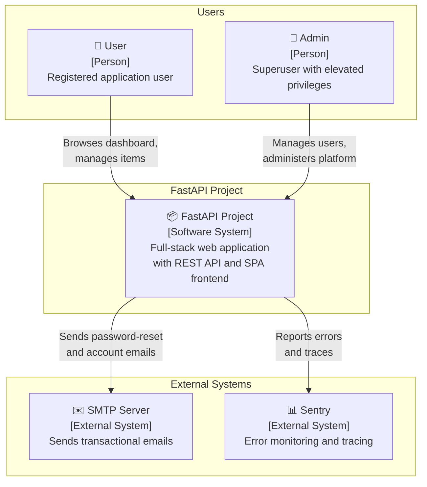
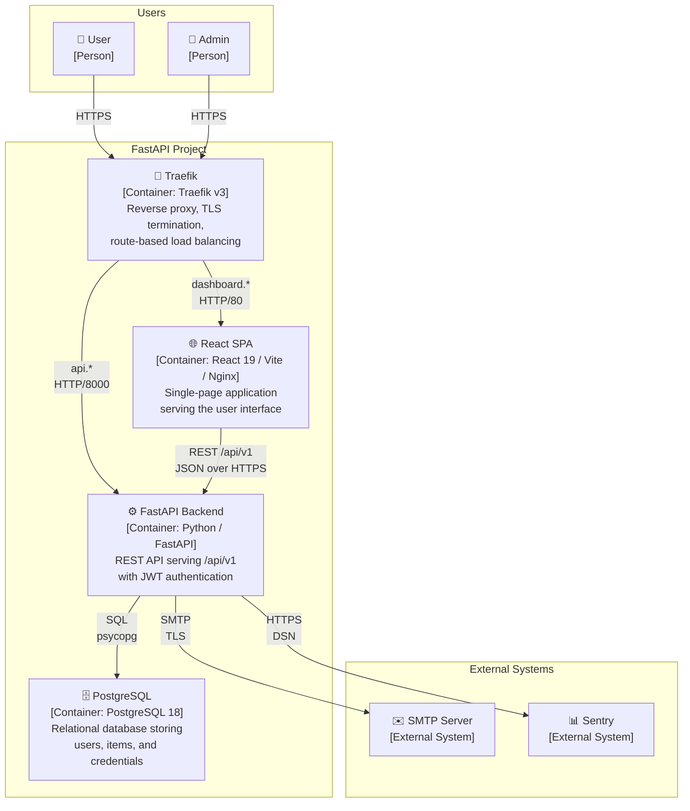
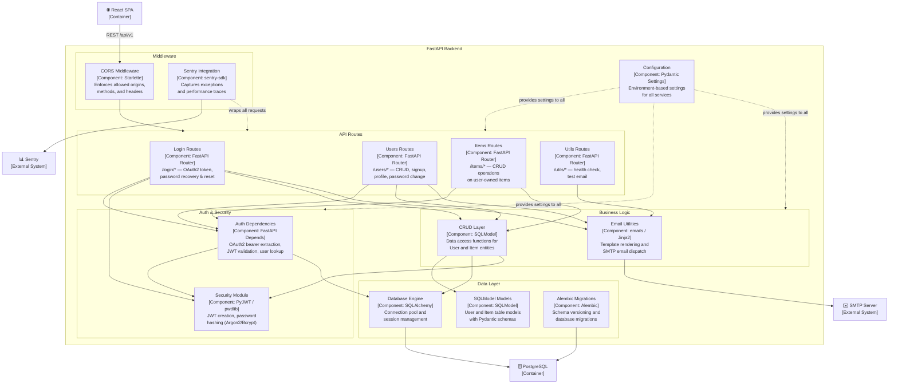
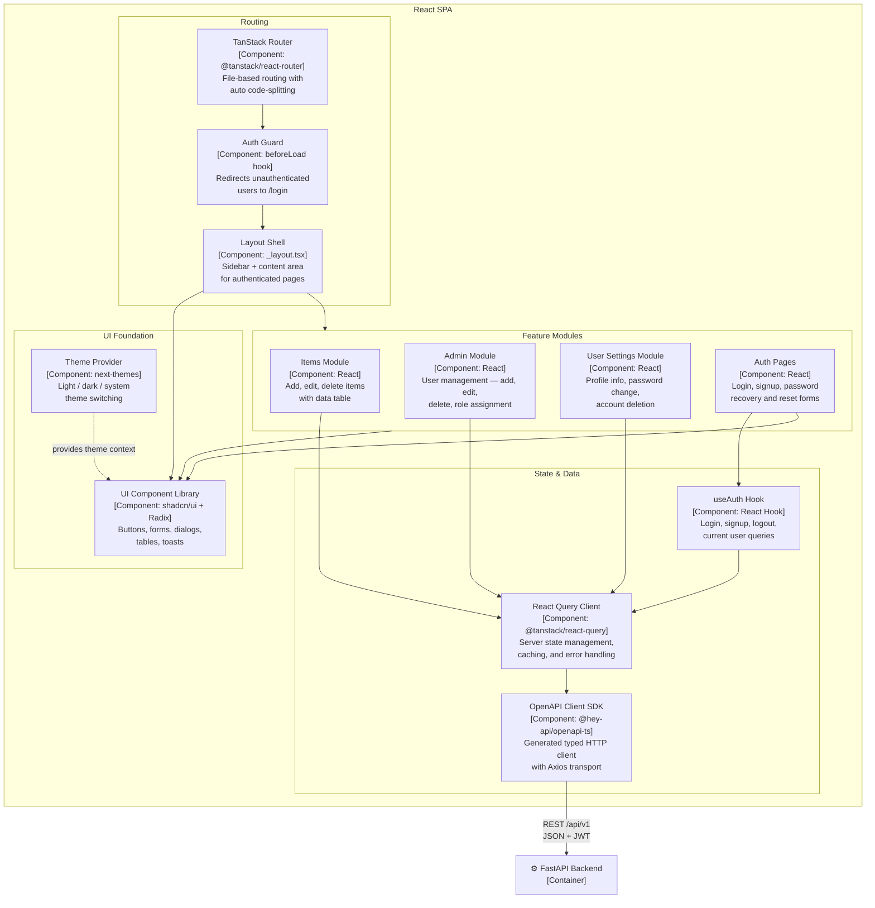
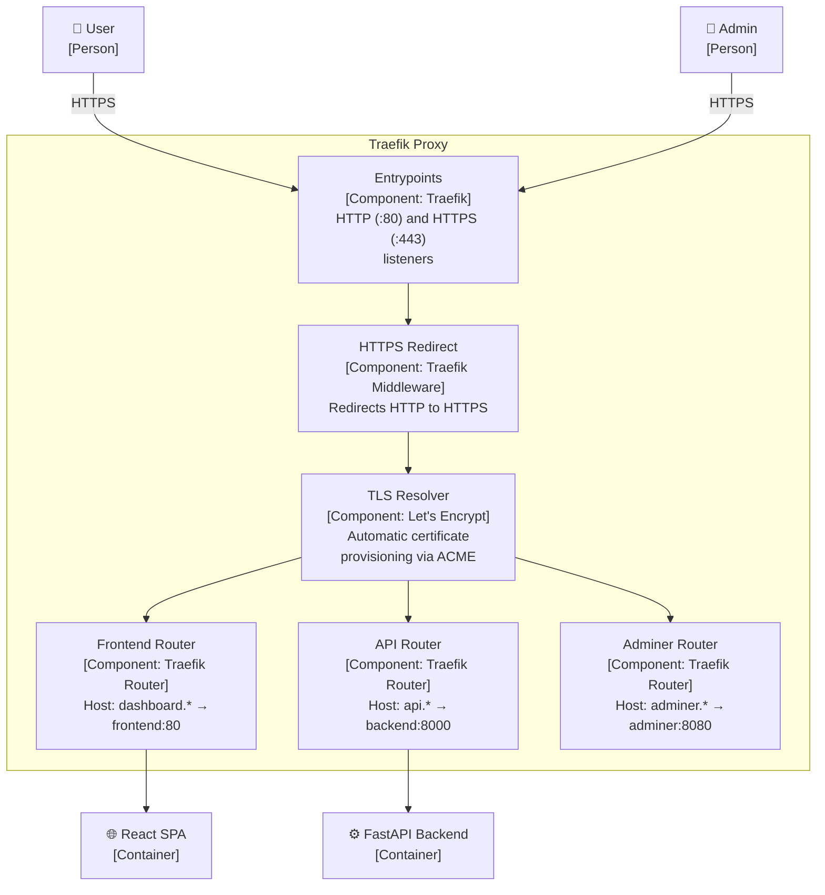
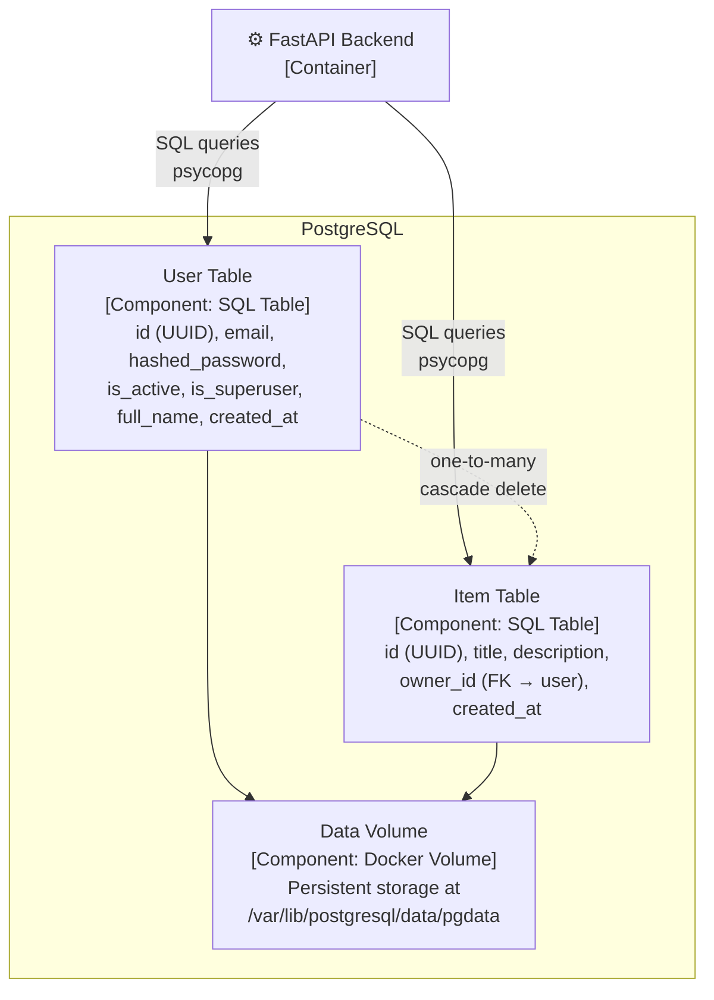

# C4 Architecture Model — Full Stack FastAPI Project

> Auto-generated C4 architecture expressed as Mermaid diagrams.
> Covers L1 (System Context), L2 (Container), and L3 (Component) views.

---

## L1: System Context



---

## L2: Container



---

## L3: FastAPI Backend



---

## L3: React SPA



---

## L3: Traefik Proxy



---

## L3: PostgreSQL



---

## Containment Map

```text
%% ══════════════════════════════════════════════════════════════════
%% CONTAINMENT MAP — covers every subgraph and node across all levels
%% ══════════════════════════════════════════════════════════════════

%% ── L1 top-level groups ───────────────────────────────────────────
users            CONTAINS [user, admin_user]
system_boundary  CONTAINS [fastapi_project]
external         CONTAINS [smtp, sentry]

%% ── L2 system internals ──────────────────────────────────────────
system_boundary  CONTAINS [traefik, spa, fastapi_api, pg]

%% ── L3: FastAPI Backend (fastapi_api) ────────────────────────────
fastapi_api      CONTAINS [middleware, routes, auth, services, data, config_mod]
  middleware     CONTAINS [cors_mw, sentry_mw]
  routes         CONTAINS [login_routes, users_routes, items_routes, utils_routes]
  auth           CONTAINS [auth_deps, security_mod]
  services       CONTAINS [crud_layer, email_utils]
  data           CONTAINS [models_layer, db_engine, alembic]

%% ── L3: React SPA (spa) ─────────────────────────────────────────
spa              CONTAINS [routing, state, features, ui]
  routing        CONTAINS [router, auth_guard, layout]
  state          CONTAINS [query_client, api_client, auth_hook]
  features       CONTAINS [items_feature, admin_feature, settings_feature, auth_pages]
  ui             CONTAINS [theme_provider, ui_lib]

%% ── L3: Traefik Proxy (traefik) ─────────────────────────────────
traefik          CONTAINS [entrypoints, https_redirect, tls_resolver, frontend_router, api_router, adminer_router]

%% ── L3: PostgreSQL (pg) ─────────────────────────────────────────
pg               CONTAINS [user_table, item_table, pgdata_volume]
```
