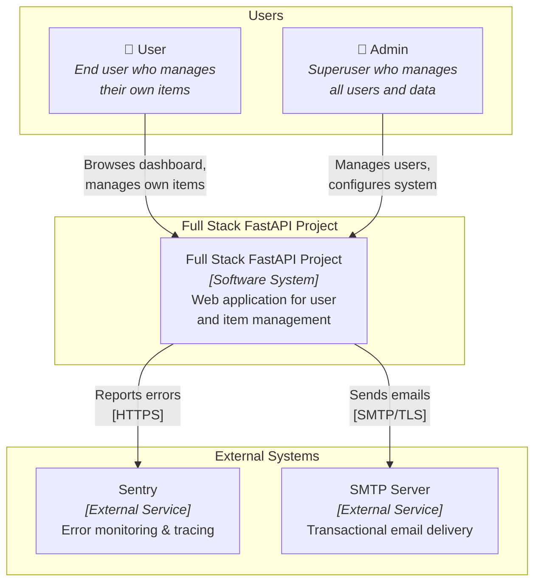
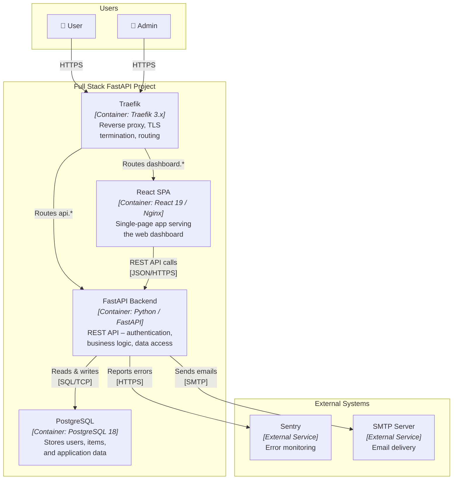
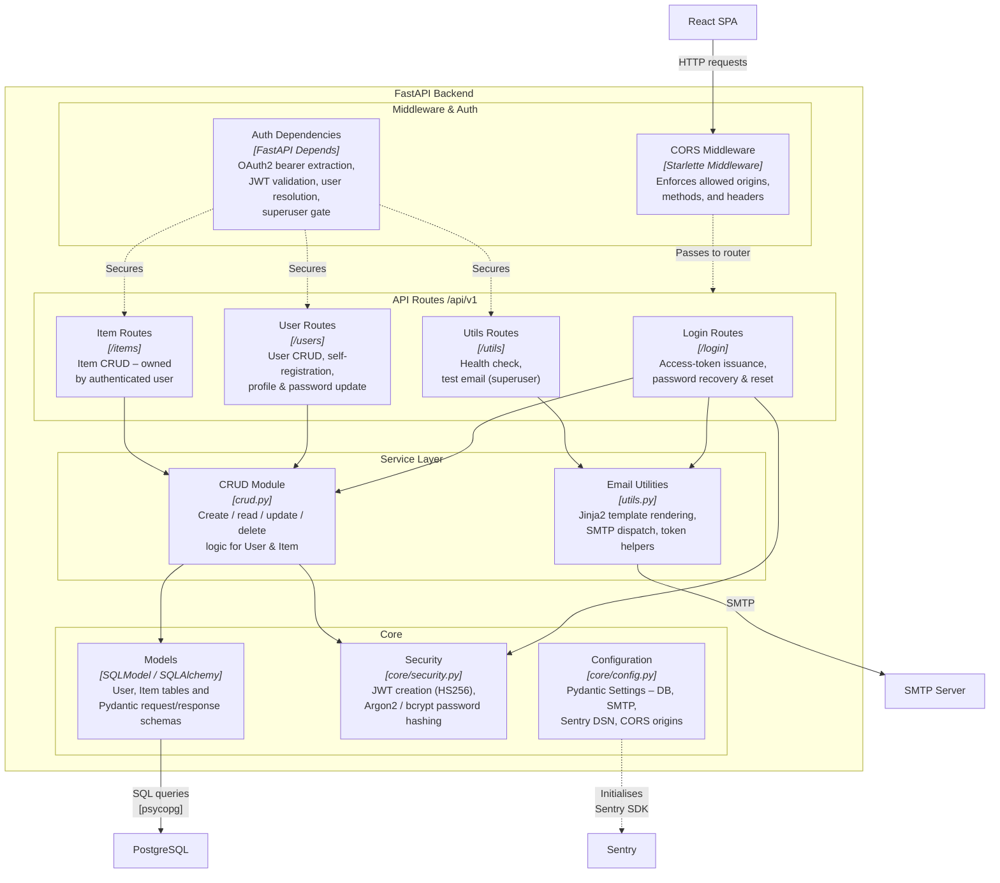
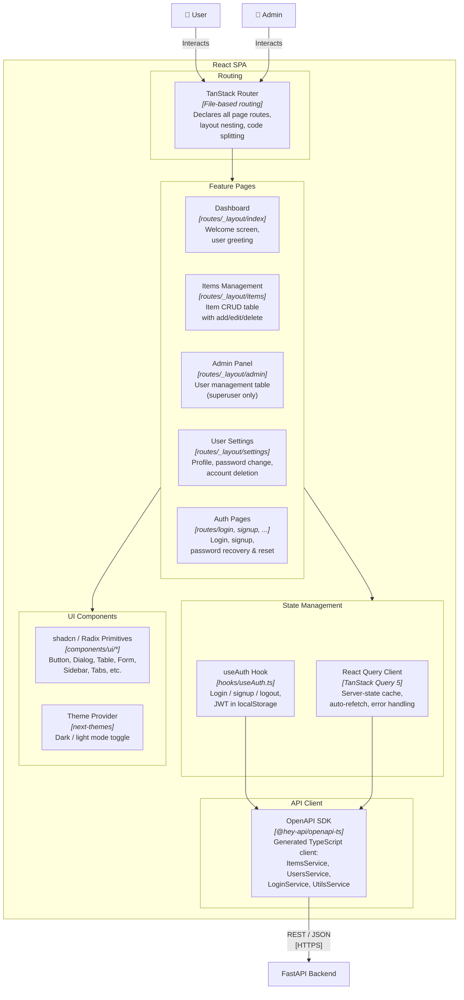

# C4 Architecture Model – Full Stack FastAPI Project

> Auto-generated C4 model covering L1 (System Context), L2 (Container),
> and L3 (Component) diagrams for every container with internal structure.

---

## L1: System Context



---

## L2: Container



---

## L3: FastAPI Backend



---

## L3: React SPA



---

## Containment Map

The containment map below lists every subgraph from every diagram and
its direct children. The parser uses this to build the full
parent → child hierarchy tree for drill-down navigation.

```text
%% ═══════════════════════════════════════════════════════════════════
%% CONTAINMENT MAP
%% ═══════════════════════════════════════════════════════════════════

%% ── L1 top-level groups ────────────────────────────────────────────
users            CONTAINS [user, admin_user]
system_boundary  CONTAINS [fastapi_system]
external         CONTAINS [sentry, smtp_server]

%% ── L2 container-level ─────────────────────────────────────────────
system_boundary  CONTAINS [traefik, spa, fastapi_backend, pg]

%% ── L3: FastAPI Backend internal containment ───────────────────────
fastapi_backend  CONTAINS [middleware, routes, services, core]
  middleware     CONTAINS [cors_mw, auth_deps]
  routes         CONTAINS [login_routes, user_routes, item_routes, utils_routes]
  services       CONTAINS [crud_layer, email_utils]
  core           CONTAINS [models_layer, security_mod, config_mod]

%% ── L3: React SPA internal containment ─────────────────────────────
spa              CONTAINS [routing, state_mgmt, api_layer, features, ui_layer]
  routing        CONTAINS [router_mod]
  state_mgmt     CONTAINS [query_client, auth_hook]
  api_layer      CONTAINS [api_client]
  features       CONTAINS [dashboard_page, items_feature, admin_feature, settings_feature, auth_pages]
  ui_layer       CONTAINS [ui_components, theme_provider]
```
