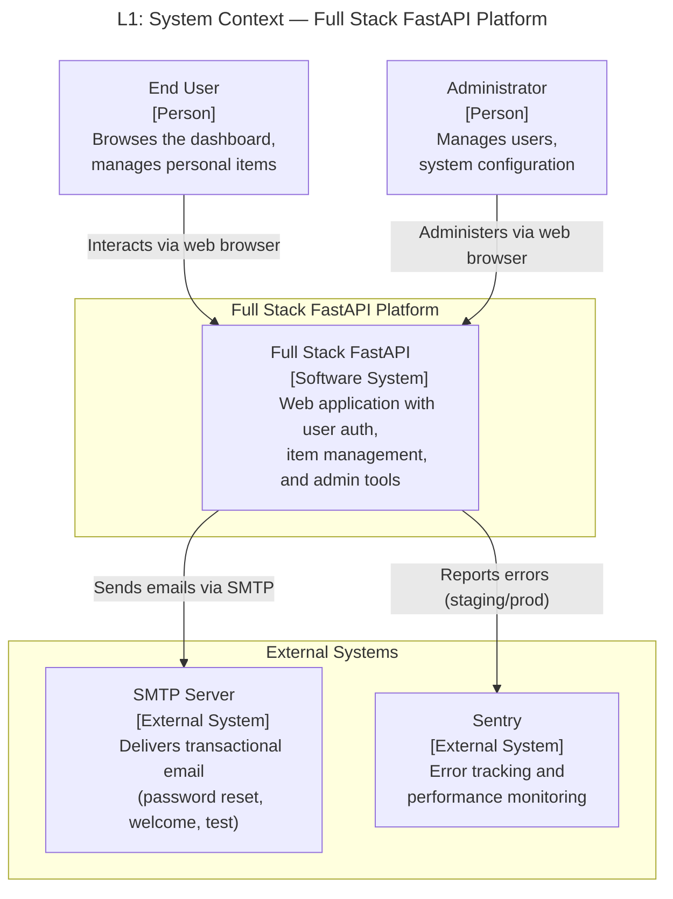
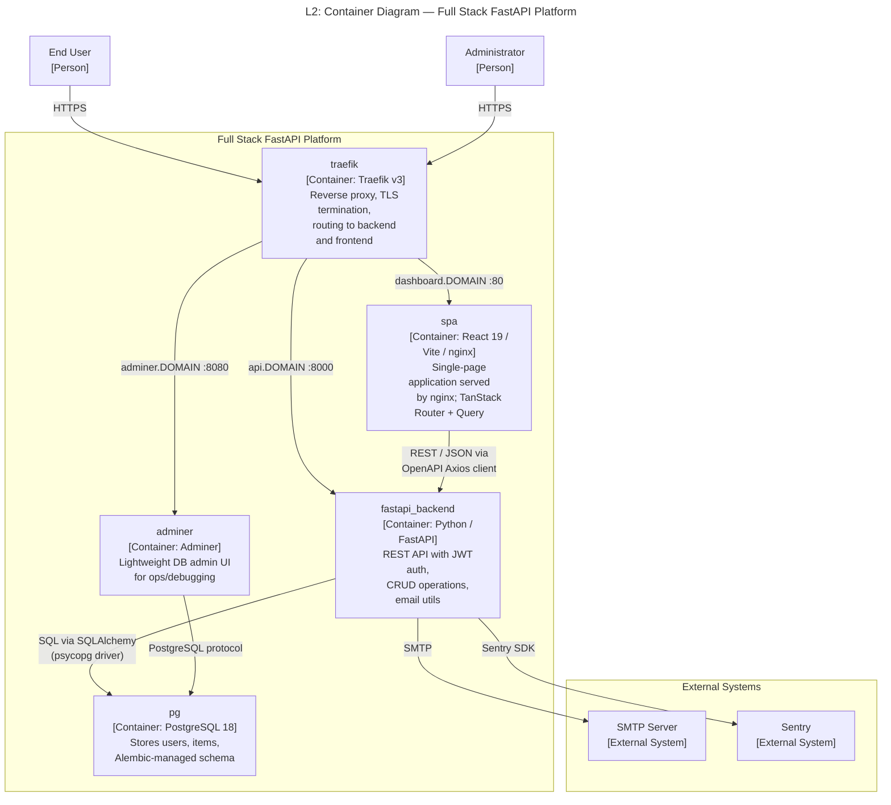
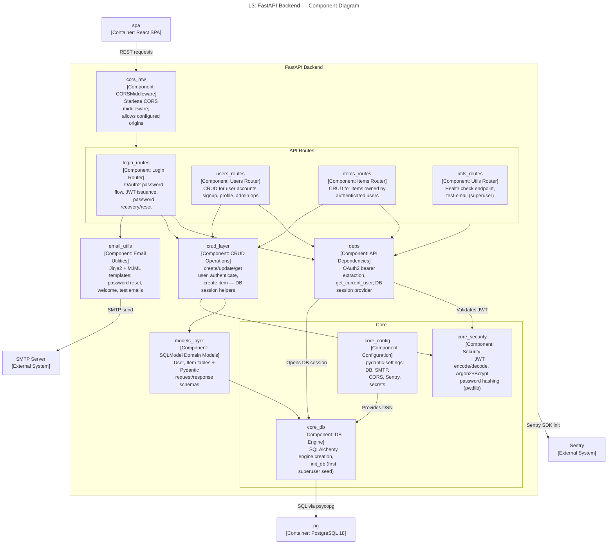
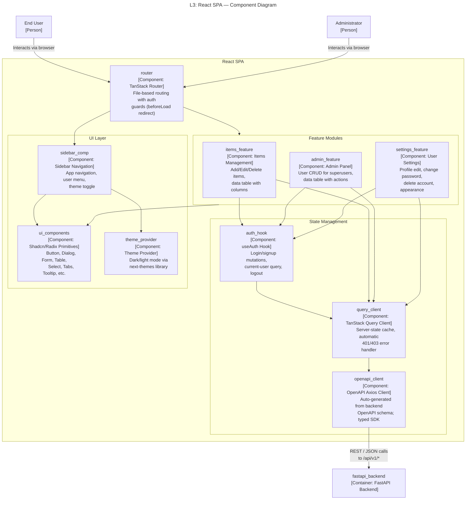
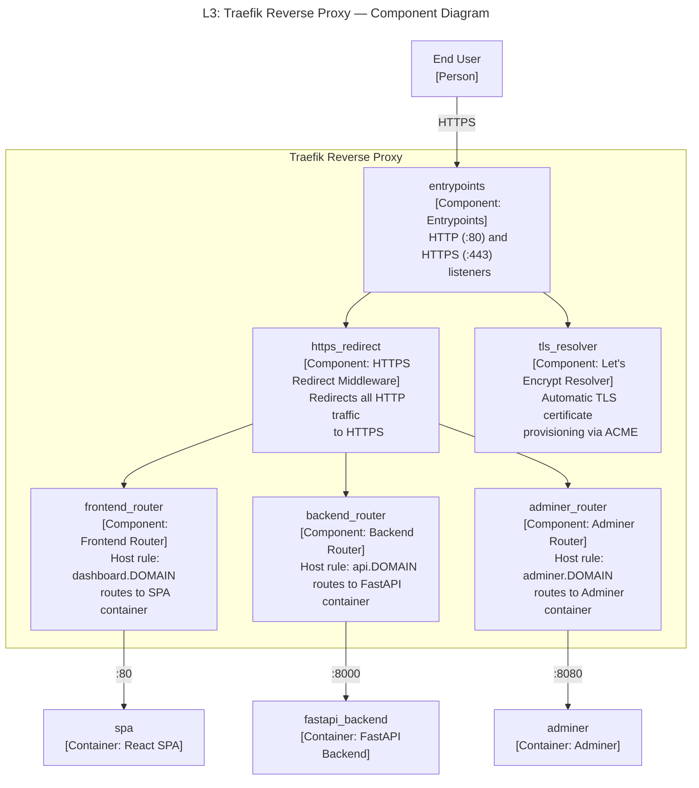

# C4 Architecture Model — Full Stack FastAPI Platform

> Auto-generated C4 model covering L1 (System Context), L2 (Container),
> and L3 (Component) diagrams for the Full Stack FastAPI template.

---

## L1: System Context



---

## L2: Container Diagram



---

## L3: FastAPI Backend



---

## L3: React SPA



---

## L3: Traefik Reverse Proxy



---

<!-- ============================================================
     CONTAINMENT MAP
     Every subgraph and node→parent relationship from all diagrams.
     The parser uses this to build the full parent→child hierarchy.
     ============================================================ -->

## Containment Map

```text
%% ── L1 top-level groups ─────────────────────────────────────────
user             CONTAINS []
admin_user       CONTAINS []
platform_boundary CONTAINS [platform]
external         CONTAINS [smtp, sentry]

%% ── L2 container-level ──────────────────────────────────────────
platform_boundary CONTAINS [traefik, spa, fastapi_backend, pg, adminer]

%% ── L3: fastapi_backend internals ───────────────────────────────
fastapi_backend  CONTAINS [cors_mw, routes, deps, crud_layer, models_layer, core, email_utils]
  routes         CONTAINS [login_routes, users_routes, items_routes, utils_routes]
  core           CONTAINS [core_security, core_config, core_db]

%% ── L3: spa internals ──────────────────────────────────────────
spa              CONTAINS [router, state_mgmt, features, ui_layer]
  state_mgmt     CONTAINS [auth_hook, query_client, openapi_client]
  features       CONTAINS [items_feature, admin_feature, settings_feature]
  ui_layer       CONTAINS [ui_components, sidebar_comp, theme_provider]

%% ── L3: traefik internals ──────────────────────────────────────
traefik          CONTAINS [entrypoints, https_redirect, frontend_router, backend_router, adminer_router, tls_resolver]
```
