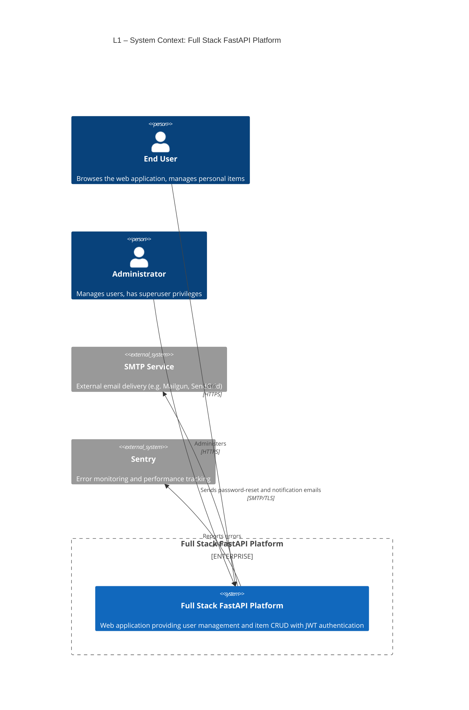
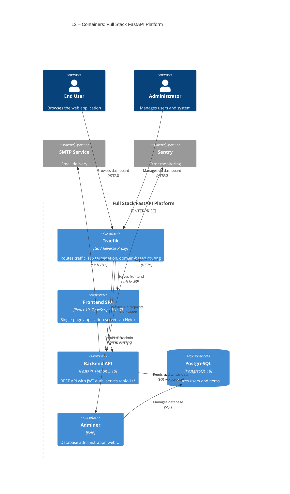
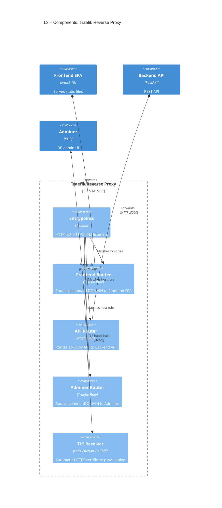
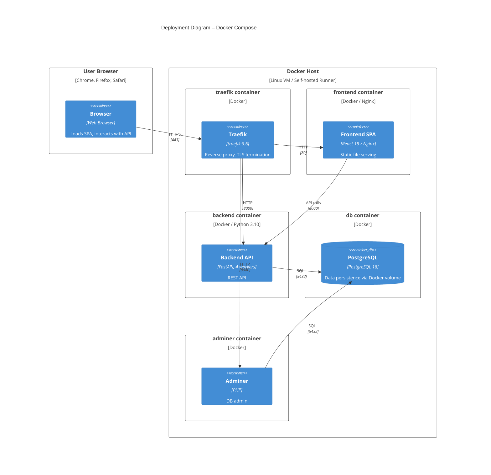

# C4 Architecture – Full Stack FastAPI Platform

> Auto-generated C4 model. Each diagram section is a self-contained Mermaid
> block that can be rendered independently.

---

## L1: System Context



---

## L2: Container Diagram



---

## L3: Backend API (fastapi_api)

```mermaid
%% SCOPE: urn:c4:container:fastapi_api
C4Component
    title L3 – Components: Backend API (FastAPI)

    Container_Boundary(fastapi_api, "Backend API") {

        %% KIND: boundary
        Boundary(middleware, "Middleware") {
            %% KIND: router
            Component(cors_mw, "CORS Middleware", "Starlette CORSMiddleware", "Handles cross-origin requests from SPA")
        }

        %% KIND: boundary
        Boundary(routes, "API Routes /api/v1") {
            %% KIND: router
            Component(login_routes, "Login Routes", "FastAPI Router", "POST /login/access-token, password recovery and reset")
            %% KIND: router
            Component(user_routes, "User Routes", "FastAPI Router", "User CRUD, signup, profile management")
            %% KIND: router
            Component(item_routes, "Item Routes", "FastAPI Router", "Item CRUD with ownership enforcement")
            %% KIND: router
            Component(utils_routes, "Utils Routes", "FastAPI Router", "Health check, test email endpoints")
            %% KIND: router
            Component(private_routes, "Private Routes", "FastAPI Router", "Local-only admin user creation")
        }

        %% KIND: boundary
        Boundary(deps, "Dependencies") {
            %% KIND: service_layer
            Component(auth_deps, "Auth Dependencies", "FastAPI Depends", "OAuth2 bearer token extraction, JWT validation, user loading")
            %% KIND: data_access
            Component(session_dep, "Session Provider", "FastAPI Depends", "Provides SQLModel Session per request")
        }

        %% KIND: boundary
        Boundary(core, "Core") {
            %% KIND: service_layer
            Component(core_config, "Configuration", "Pydantic Settings", "Loads env vars: DB, SMTP, JWT, CORS settings")
            %% KIND: data_access
            Component(core_db, "Database Engine", "SQLAlchemy + SQLModel", "Connection pool, engine creation, init_db")
            %% KIND: service_layer
            Component(core_security, "Security", "python-jose, passlib", "JWT token creation/verification, Argon2/Bcrypt password hashing")
        }

        %% KIND: service_layer
        Component(crud_layer, "CRUD Layer", "Python", "create_user, update_user, authenticate, create_item")

        %% KIND: data_access
        Component(models_layer, "Models", "SQLModel", "User and Item table models, Pydantic schemas")

        %% KIND: integration
        Component(email_utils, "Email Utilities", "emails + Jinja2", "Renders and sends password-reset, new-account, test emails via SMTP")
    }

    ContainerDb(pg, "PostgreSQL", "PostgreSQL 18", "User and Item storage")
    System_Ext(smtp_service, "SMTP Service", "Email delivery")
    System_Ext(sentry_service, "Sentry", "Error monitoring")
    Container(spa, "Frontend SPA", "React 19", "Calls API endpoints")

    Rel(spa, cors_mw, "HTTP requests", "JSON/HTTPS")
    Rel(cors_mw, routes, "Forwards", "HTTP")
    Rel(login_routes, auth_deps, "Validates credentials", "")
    Rel(login_routes, core_security, "Creates JWT tokens", "")
    Rel(login_routes, email_utils, "Sends recovery email", "")
    Rel(user_routes, auth_deps, "Requires authentication", "")
    Rel(user_routes, crud_layer, "User operations", "")
    Rel(item_routes, auth_deps, "Requires authentication", "")
    Rel(item_routes, crud_layer, "Item operations", "")
    Rel(utils_routes, email_utils, "Sends test email", "")
    Rel(private_routes, crud_layer, "Creates admin user", "")
    Rel(auth_deps, core_security, "Verifies JWT", "")
    Rel(auth_deps, session_dep, "Gets DB session", "")
    Rel(crud_layer, models_layer, "Uses models", "")
    Rel(crud_layer, session_dep, "Gets DB session", "")
    Rel(session_dep, core_db, "Creates session", "")
    Rel(core_db, core_config, "Reads DB URI", "")
    Rel(core_db, pg, "Connects", "SQL via psycopg")
    Rel(email_utils, smtp_service, "Sends email", "SMTP/TLS")
    Rel(email_utils, core_config, "Reads SMTP settings", "")
    Rel(core_security, core_config, "Reads secret key", "")
```

---

## L3: Frontend SPA (spa)

```mermaid
%% SCOPE: urn:c4:container:spa
C4Component
    title L3 – Components: Frontend SPA (React)

    Container_Boundary(spa, "Frontend SPA") {

        %% KIND: boundary
        Boundary(routing_layer, "Routing") {
            %% KIND: router
            Component(routing, "TanStack Router", "TanStack Router, file-based", "Defines routes: /, /login, /signup, /items, /settings, /admin")
            %% KIND: service_layer
            Component(route_guards, "Route Guards", "beforeLoad hooks", "Auth redirect for protected routes, superuser check for /admin")
        }

        %% KIND: boundary
        Boundary(state_layer, "State Management") {
            %% KIND: service_layer
            Component(auth_hooks, "Auth Hooks", "React Hooks", "useAuth: login/signup mutations, logout, current user query")
            %% KIND: service_layer
            Component(query_client, "Query Layer", "TanStack Query v5", "Server state caching, 401/403 interceptors, query invalidation")
            %% KIND: service_layer
            Component(theme_provider, "Theme Provider", "React Context", "Dark/light/system mode via localStorage")
        }

        %% KIND: boundary
        Boundary(services_layer, "Services") {
            %% KIND: integration
            Component(api_client, "API Client", "OpenAPI Generated, Axios", "Type-safe SDK: LoginService, UsersService, ItemsService, UtilsService")
        }

        %% KIND: boundary
        Boundary(features, "Features") {
            %% KIND: service_layer
            Component(items_feature, "Items Feature", "React Components", "Item list, add, edit, delete with DataTable")
            %% KIND: service_layer
            Component(admin_feature, "Admin Feature", "React Components", "User management: list, add, edit, delete (superuser only)")
            %% KIND: service_layer
            Component(settings_feature, "Settings Feature", "React Components", "Profile editing, password change, account deletion")
            %% KIND: service_layer
            Component(dashboard_feature, "Dashboard", "React Component", "Welcome/landing page for authenticated users")
            %% KIND: service_layer
            Component(auth_pages, "Auth Pages", "React Components", "Login, signup, password recovery, password reset forms")
        }

        %% KIND: boundary
        Boundary(ui_layer, "UI Layer") {
            %% KIND: service_layer
            Component(common_ui, "Common Components", "React", "AuthLayout, DataTable, ErrorComponent, Footer, Logo, NotFound")
            %% KIND: service_layer
            Component(sidebar_nav, "Sidebar Navigation", "React", "AppSidebar with user menu and main navigation")
            %% KIND: service_layer
            Component(ui_primitives, "UI Primitives", "shadcn/ui, Radix", "Button, Input, Dialog, Select, Card, Table, Form, Sonner")
        }
    }

    Container(fastapi_api, "Backend API", "FastAPI", "REST API")

    Rel(routing, route_guards, "Applies guards", "")
    Rel(route_guards, auth_hooks, "Checks auth state", "")
    Rel(routing, features, "Renders pages", "")
    Rel(routing, ui_layer, "Uses layout", "")
    Rel(auth_hooks, api_client, "Calls login/signup", "")
    Rel(auth_hooks, query_client, "Manages user query", "")
    Rel(items_feature, query_client, "Fetches/mutates items", "")
    Rel(admin_feature, query_client, "Fetches/mutates users", "")
    Rel(settings_feature, query_client, "Updates profile", "")
    Rel(dashboard_feature, auth_hooks, "Gets current user", "")
    Rel(auth_pages, auth_hooks, "Login/signup flow", "")
    Rel(query_client, api_client, "Delegates HTTP calls", "")
    Rel(api_client, fastapi_api, "REST API calls", "JSON/HTTPS via Axios")
    Rel(items_feature, common_ui, "Uses DataTable", "")
    Rel(admin_feature, common_ui, "Uses DataTable", "")
    Rel(features, ui_primitives, "Uses UI components", "")
    Rel(features, sidebar_nav, "Embedded in layout", "")
    Rel(sidebar_nav, ui_primitives, "Built from", "")
    Rel(common_ui, ui_primitives, "Built from", "")
```

---

## L3: Traefik Proxy (traefik_proxy)



---

## Deployment Diagram



---

## Containment Map

```text
%% ══════════════════════════════════════════════════════════════════
%% CONTAINMENT MAP — covers all levels (L1 → L2 → L3 → Deployment)
%% Every subgraph from every diagram appears as a CONTAINS entry.
%% ══════════════════════════════════════════════════════════════════

%% ── L1 top-level groups ─────────────────────────────────────────
users                CONTAINS [user, admin_user]
fullstack_boundary   CONTAINS [fullstack_system]
external             CONTAINS [smtp_service, sentry_service]

%% ── L2 system → containers ──────────────────────────────────────
fullstack_system     CONTAINS [traefik_proxy, spa, fastapi_api, pg, adminer]

%% ── L3: fastapi_api internal containment ────────────────────────
fastapi_api          CONTAINS [middleware, routes, deps, core, crud_layer, models_layer, email_utils]
  middleware         CONTAINS [cors_mw]
  routes             CONTAINS [login_routes, user_routes, item_routes, utils_routes, private_routes]
  deps               CONTAINS [auth_deps, session_dep]
  core               CONTAINS [core_config, core_db, core_security]

%% ── L3: spa internal containment ────────────────────────────────
spa                  CONTAINS [routing_layer, state_layer, services_layer, features, ui_layer]
  routing_layer      CONTAINS [routing, route_guards]
  state_layer        CONTAINS [auth_hooks, query_client, theme_provider]
  services_layer     CONTAINS [api_client]
  features           CONTAINS [items_feature, admin_feature, settings_feature, dashboard_feature, auth_pages]
  ui_layer           CONTAINS [common_ui, sidebar_nav, ui_primitives]

%% ── L3: traefik_proxy internal containment ──────────────────────
traefik_proxy        CONTAINS [entrypoints, frontend_router, api_router, adminer_router, tls_resolver]

%% ── Deployment containment ──────────────────────────────────────
deployment           CONTAINS [browser_node, docker_host]
  browser_node       CONTAINS [browser]
  docker_host        CONTAINS [traefik_ctr, frontend_ctr, backend_ctr, db_ctr, adminer_ctr]
    traefik_ctr      CONTAINS [traefik_proxy]
    frontend_ctr     CONTAINS [spa]
    backend_ctr      CONTAINS [fastapi_api]
    db_ctr           CONTAINS [pg]
    adminer_ctr      CONTAINS [adminer]
```
