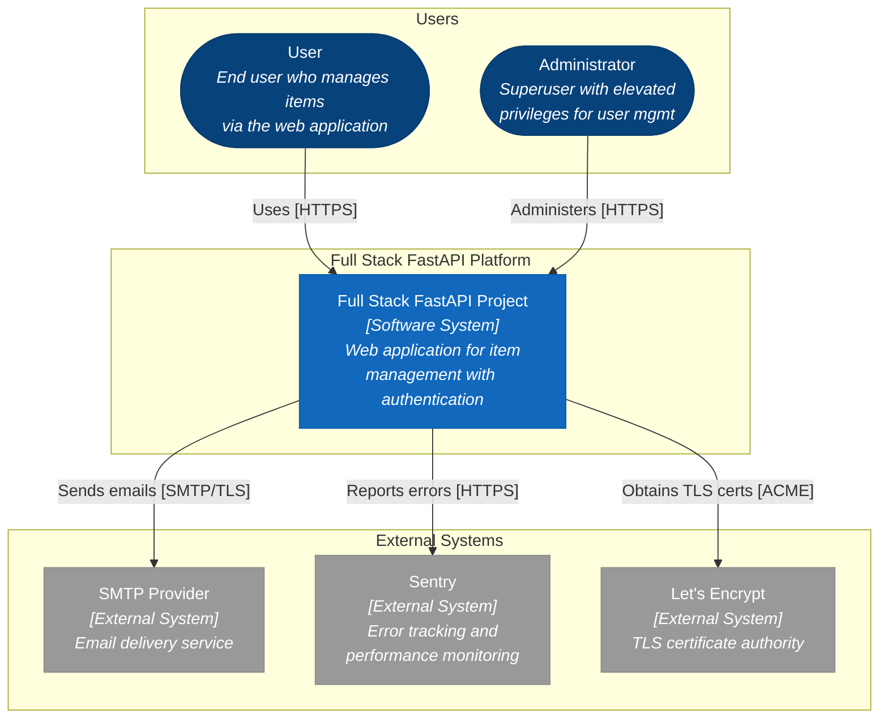
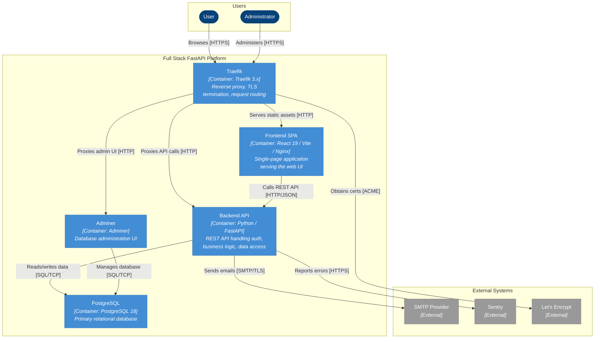
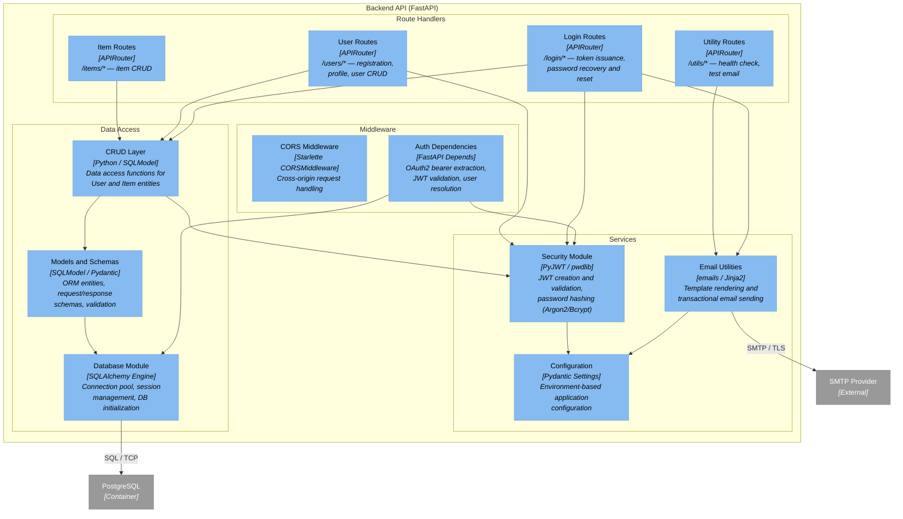
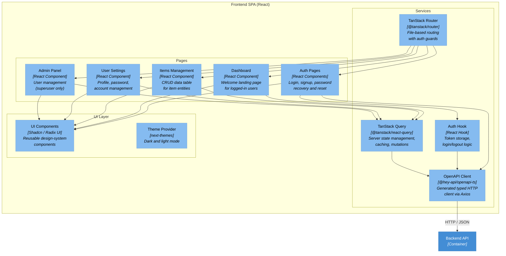

# C4 Architecture Model — Full Stack FastAPI Project

> Auto-generated C4 model covering L1 (System Context), L2 (Container),
> and L3 (Component) diagrams for the Full Stack FastAPI Project.

---

## L1: System Context



---

## L2: Container



---

## L3: Backend API



---

## L3: Frontend SPA



---

## Containment Map

```text
%% ── CONTAINMENT MAP ─────────────────────────────────────────────────────────

%% ── L1 top-level groups ─────────────────────────────────────────────────────
users              CONTAINS [user, admin_user]
platform_boundary  CONTAINS [traefik, spa, backend_api, pg, adminer]
external           CONTAINS [smtp, sentry, letsencrypt]

%% ── L2→L3 internal containment (Backend API) ───────────────────────────────
backend_api        CONTAINS [mw, routes, services, data_access]
  mw               CONTAINS [cors_mw, auth_deps]
  routes           CONTAINS [login_routes, user_routes, item_routes, util_routes]
  services         CONTAINS [security_mod, email_utils, config_mod]
  data_access      CONTAINS [crud_layer, models_layer, db_mod]

%% ── L2→L3 internal containment (Frontend SPA) ──────────────────────────────
spa                CONTAINS [pages, services_layer, ui_layer]
  pages            CONTAINS [auth_pages, dashboard_page, items_page, settings_page, admin_page]
  services_layer   CONTAINS [routing, api_client, query_layer, auth_hook]
  ui_layer         CONTAINS [ui_lib, theme_provider]
```
