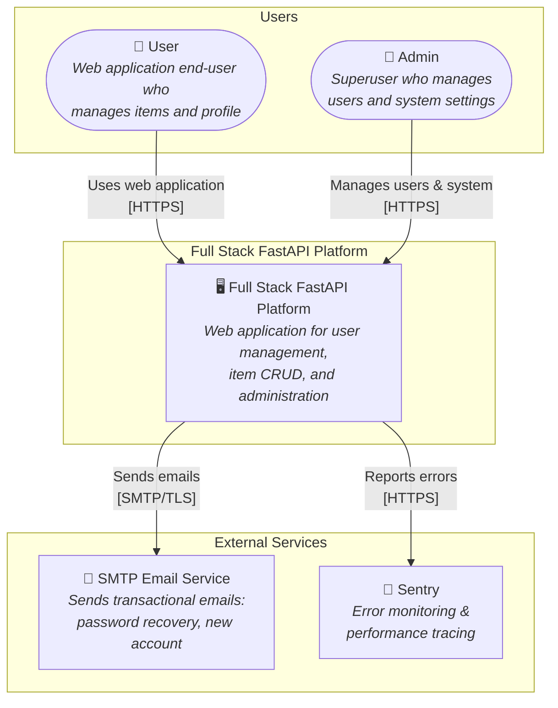
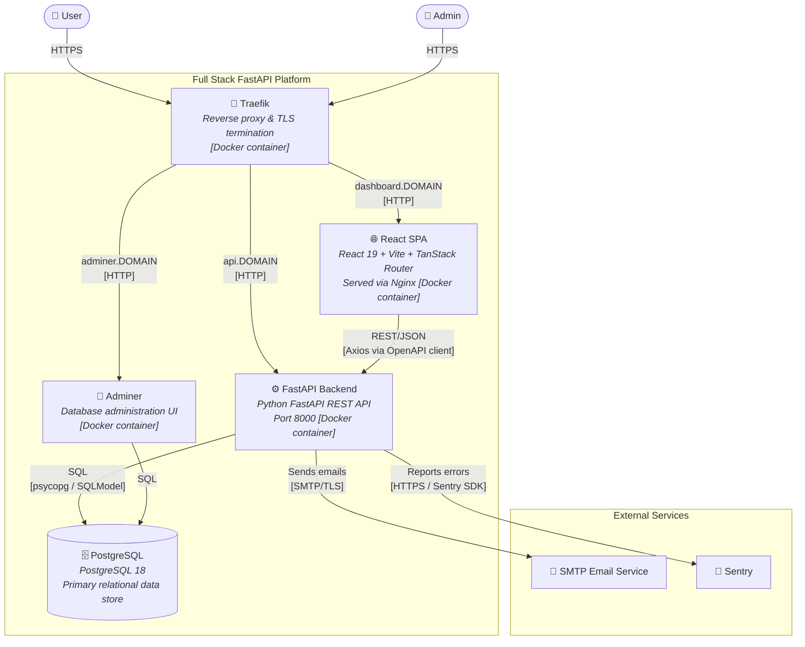
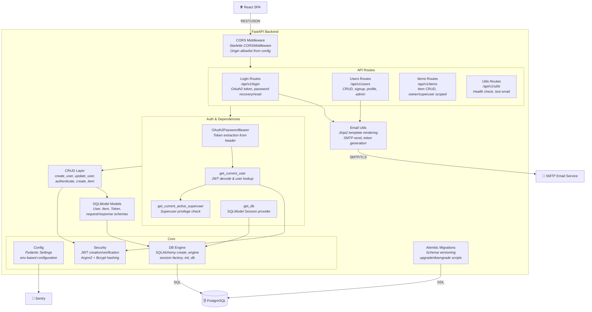
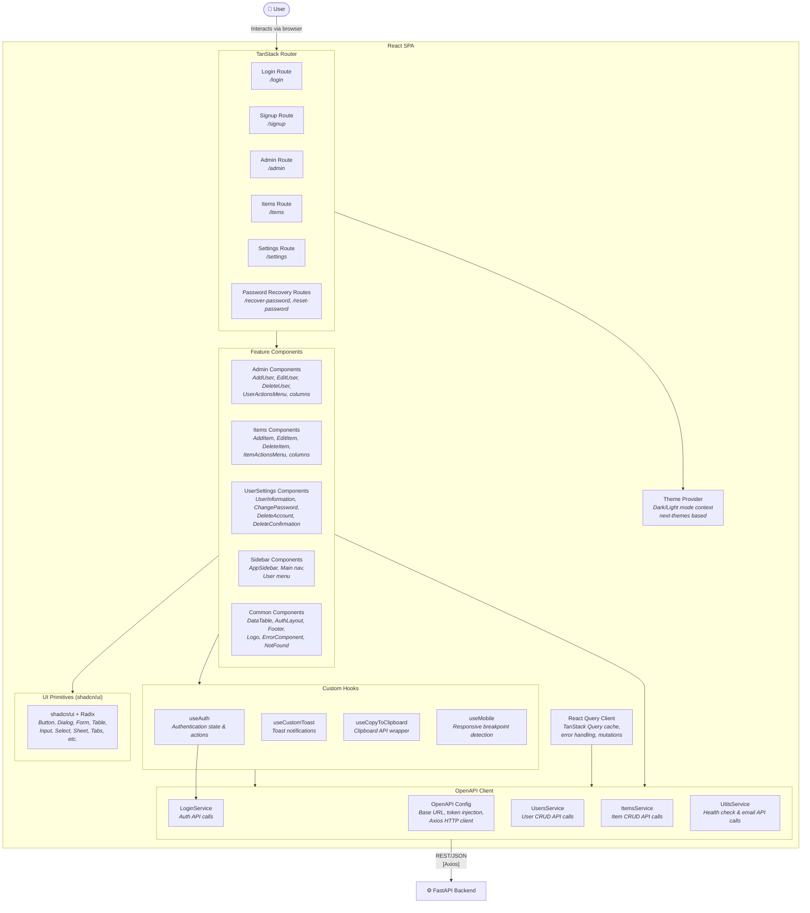

# C4 Architecture Model — Full Stack FastAPI Template

> Auto-generated C4 model covering L1 (System Context), L2 (Container),
> and L3 (Component) diagrams for every container with internal structure.

---

## L1: System Context



---

## L2: Container Diagram



---

## L3: FastAPI Backend



---

## L3: React SPA



---

## Containment Map

```text
%% ══════════════════════════════════════════════════════════════════
%% CONTAINMENT MAP — Full Stack FastAPI Template
%% Every subgraph/node from every diagram is listed below.
%% Nesting is expressed by indentation.
%% ══════════════════════════════════════════════════════════════════

%% ── L1 top-level groups ─────────────────────────────────────────
users              CONTAINS [user, admin_user]
platform_boundary  CONTAINS [platform]
external           CONTAINS [smtp_service, sentry]

%% ── L2 container-level ──────────────────────────────────────────
platform_boundary  CONTAINS [traefik, spa, fastapi_backend, pg, adminer]
external           CONTAINS [smtp_service, sentry]

%% ── L3: FastAPI Backend (fastapi_backend) ───────────────────────
fastapi_backend    CONTAINS [cors_mw, api_routes, auth_deps, crud_layer, models_layer, core, email_utils, alembic]
  api_routes       CONTAINS [login_routes, users_routes, items_routes, utils_routes]
  auth_deps        CONTAINS [oauth2_bearer, get_current_user_dep, get_superuser_dep, get_db_dep]
  core             CONTAINS [core_config, core_db, core_security]

%% ── L3: React SPA (spa) ────────────────────────────────────────
spa                CONTAINS [routing, features, ui_layer, hooks_layer, api_client, theme_provider, query_client]
  routing          CONTAINS [route_login, route_signup, route_admin, route_items, route_settings, route_password]
  features         CONTAINS [admin_components, items_components, settings_components, sidebar_components, common_components]
  ui_layer         CONTAINS [shadcn_ui]
  hooks_layer      CONTAINS [use_auth, use_toast, use_clipboard, use_mobile]
  api_client       CONTAINS [openapi_config, login_service, users_service, items_service, utils_service]
```
