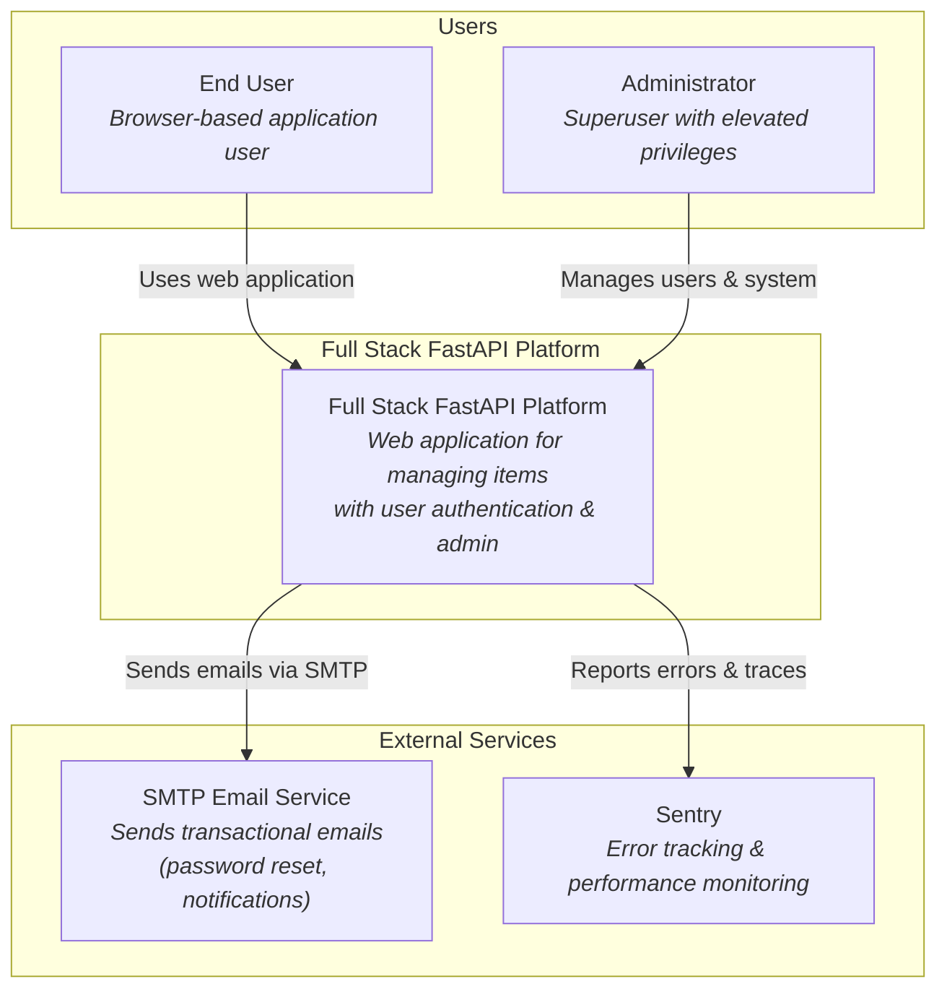
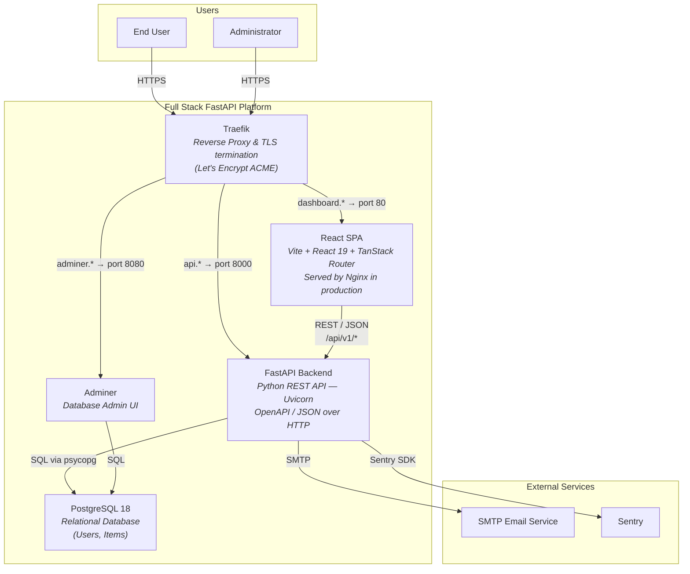
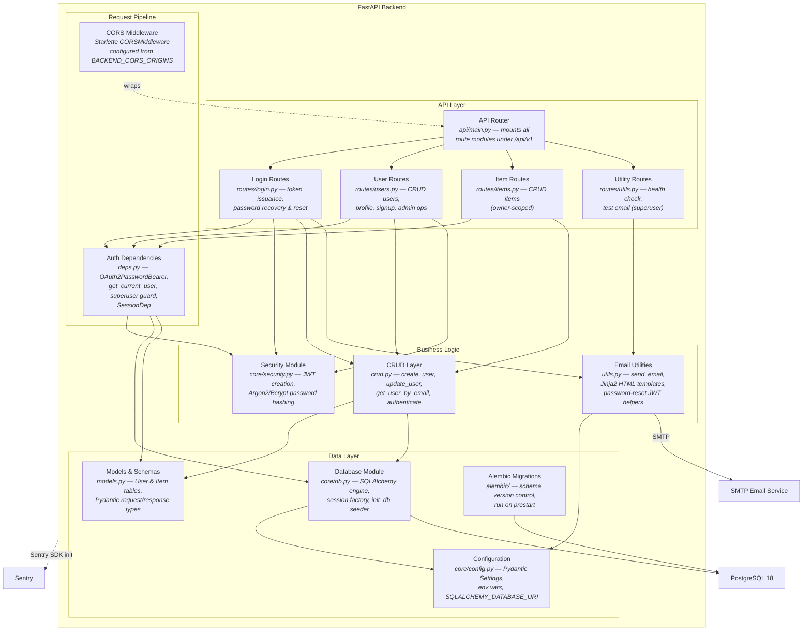
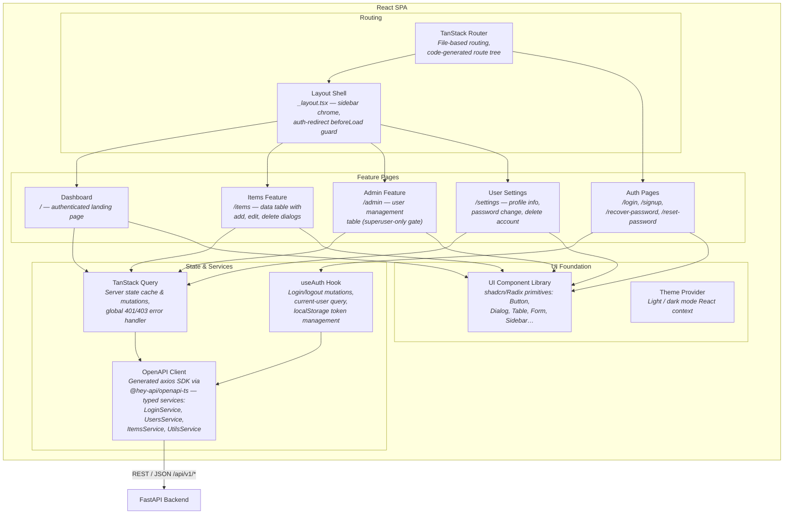

# C4 Architecture – Full Stack FastAPI Project

---

## L1: System Context



---

## L2: Container



---

## L3: FastAPI Backend



---

## L3: React SPA



---

## CONTAINMENT MAP

```
%% ══════════════════════════════════════════════════════════════════
%% CONTAINMENT MAP — covers ALL levels (L1 → L2 → L3)
%% ══════════════════════════════════════════════════════════════════

%% ── L1 top-level groups ─────────────────────────────────────────
users              CONTAINS [user, admin_user]
platform_boundary  CONTAINS [traefik, spa, fastapi_backend, pg, adminer]
external           CONTAINS [smtp_server, sentry]

%% ── L2 → L3 internal containment: FastAPI Backend ───────────────
fastapi_backend    CONTAINS [api_layer, middleware_layer, service_layer, data_layer]
  api_layer        CONTAINS [api_router, auth_routes, user_routes, item_routes, util_routes]
  middleware_layer  CONTAINS [cors_mw, auth_deps]
  service_layer    CONTAINS [crud_layer, email_utils, security_mod]
  data_layer       CONTAINS [models_layer, db_mod, config_mod, alembic_migrations]

%% ── L2 → L3 internal containment: React SPA ────────────────────
spa                CONTAINS [routing, features, state_layer, ui_layer]
  routing          CONTAINS [router, layout_shell]
  features         CONTAINS [dashboard_page, items_feature, admin_feature, settings_feature, auth_pages]
  state_layer      CONTAINS [auth_hook, api_client, query_client]
  ui_layer         CONTAINS [ui_components, theme_provider]
```
