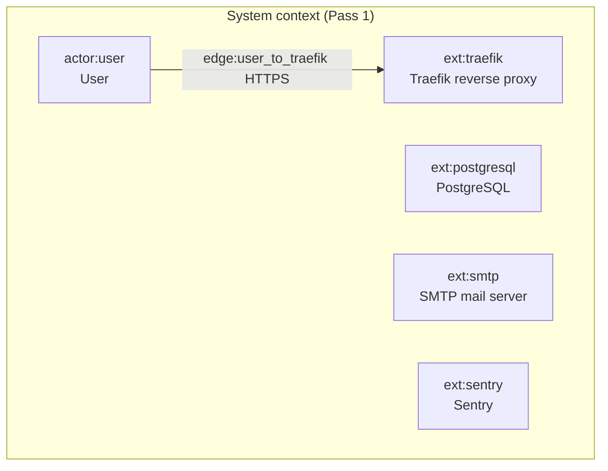

# Live C4 Preview

```mermaid
flowchart TD
  subgraph L1["System context (Pass 1)"]
    actor_user["actor:user<br/>User"]
    ext_pg["ext:postgresql<br/>PostgreSQL"]
    ext_tr["ext:traefik<br/>Traefik reverse proxy"]
    ext_smtp["ext:smtp<br/>SMTP mail server"]
    ext_sentry["ext:sentry<br/>Sentry"]
    actor_user -->|"edge:user_to_traefik HTTPS"| ext_tr
  end
```
