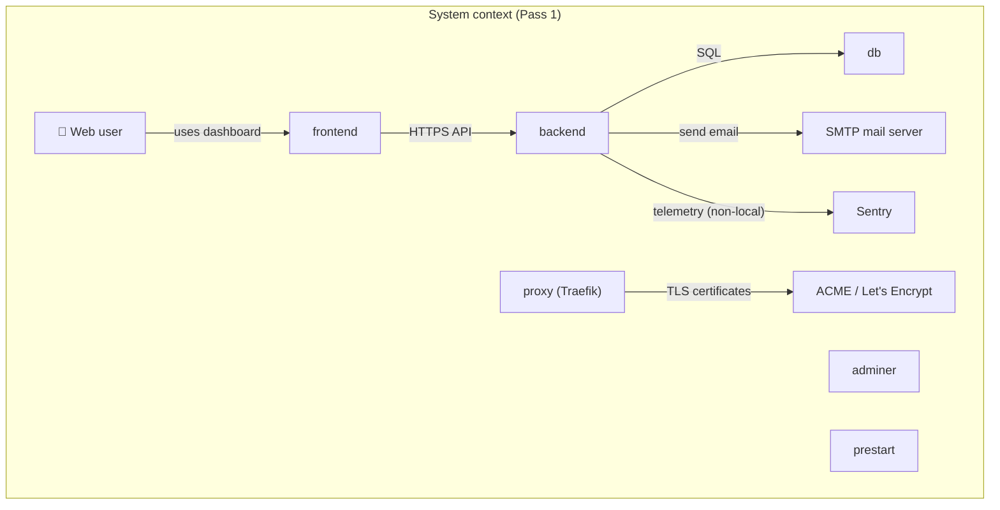

# Live C4 Preview

```mermaid
flowchart TD
  subgraph L1["System context (Pass 1)"]
    actor_end_user["👤 Web user"]
    ext_smtp["SMTP mail server"]
    ext_sentry["Sentry"]
    ext_acme["ACME / Let's Encrypt"]
    c_backend["backend"]
    c_frontend["frontend"]
    c_db["db"]
    c_proxy["proxy (Traefik)"]
    c_adminer["adminer"]
    c_prestart["prestart"]
  end
  actor_end_user -->|"uses dashboard"| c_frontend
  c_frontend -->|"HTTPS API"| c_backend
  c_backend -->|"SQL"| c_db
  c_backend -->|"send email"| ext_smtp
  c_backend -->|"telemetry (non-local)"| ext_sentry
  c_proxy -->|"TLS certificates"| ext_acme
```
