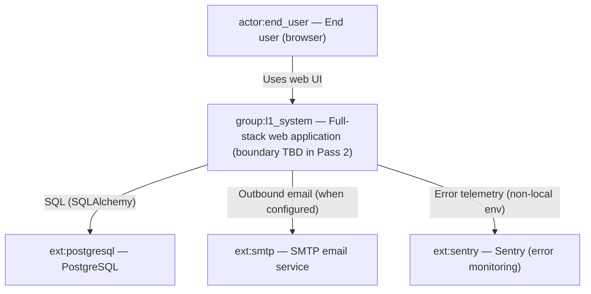

# Live C4 Preview

```mermaid
flowchart TD
  actor_end_user["actor:end_user — End user (browser)"]
  group_l1["group:l1_system — Full-stack web application (boundary TBD in Pass 2)"]
  ext_pg["ext:postgresql — PostgreSQL"]
  ext_smtp["ext:smtp — SMTP email service"]
  ext_sentry["ext:sentry — Sentry (error monitoring)"]
  actor_end_user -->|"Uses web UI"| group_l1
  group_l1 -->|"SQL (SQLAlchemy)"| ext_pg
  group_l1 -->|"Outbound email (when configured)"| ext_smtp
  group_l1 -->|"Error telemetry (non-local env)"| ext_sentry
```
