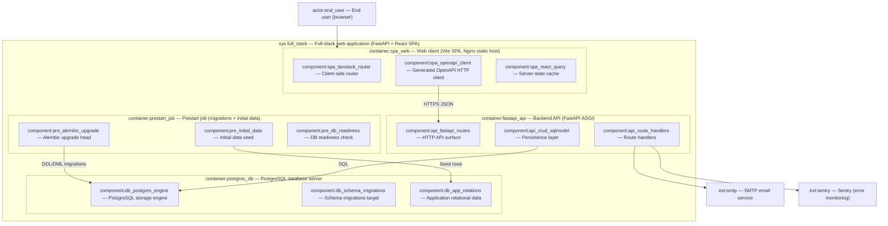

# Live C4 Preview

```mermaid
flowchart TD
  actor_end_user["actor:end_user — End user (browser)"]
  ext_smtp["ext:smtp — SMTP email service"]
  ext_sentry["ext:sentry — Sentry (error monitoring)"]
  subgraph sys_full_stack["sys:full_stack — Full-stack web application (FastAPI + React SPA)"]
    direction TB
    subgraph spa_c["container:spa_web — Web client (Vite SPA, Nginx static host)"]
      direction TB
      %% SCOPE: urn:c4:container:container:spa_web
      spa_r["component:spa_tanstack_router — Client-side router"]
      %% KIND: router
      spa_o["component:spa_openapi_client — Generated OpenAPI HTTP client"]
      %% KIND: integration
      spa_q["component:spa_react_query — Server-state cache"]
      %% KIND: storage
    end
    subgraph api_c["container:fastapi_api — Backend API (FastAPI ASGI)"]
      direction TB
      %% SCOPE: urn:c4:container:container:fastapi_api
      api_rt["component:api_fastapi_routes — HTTP API surface"]
      %% KIND: router
      api_h["component:api_route_handlers — Route handlers"]
      %% KIND: service_layer
      api_d["component:api_crud_sqlmodel — Persistence layer"]
      %% KIND: data_access
    end
    subgraph db_c["container:postgres_db — PostgreSQL database server"]
      direction TB
      %% SCOPE: urn:c4:container:container:postgres_db
      db_e["component:db_postgres_engine — PostgreSQL storage engine"]
      %% KIND: storage
      db_m["component:db_schema_migrations — Schema migrations target"]
      %% KIND: pipeline
      db_a["component:db_app_relations — Application relational data"]
      %% KIND: storage
    end
    subgraph pre_c["container:prestart_job — Prestart job (migrations + initial data)"]
      direction TB
      %% SCOPE: urn:c4:container:container:prestart_job
      pre_a["component:pre_alembic_upgrade — Alembic upgrade head"]
      %% KIND: pipeline
      pre_i["component:pre_initial_data — Initial data seed"]
      %% KIND: worker
      pre_r["component:pre_db_readiness — DB readiness check"]
      %% KIND: integration
    end
  end
  actor_end_user --> spa_c
  spa_o -->|"HTTPS JSON"| api_rt
  api_d -->|"SQL"| db_e
  pre_a -->|"DDL/DML migrations"| db_e
  pre_i -->|"Seed rows"| db_a
  api_h --> ext_smtp
  api_h --> ext_sentry
```
