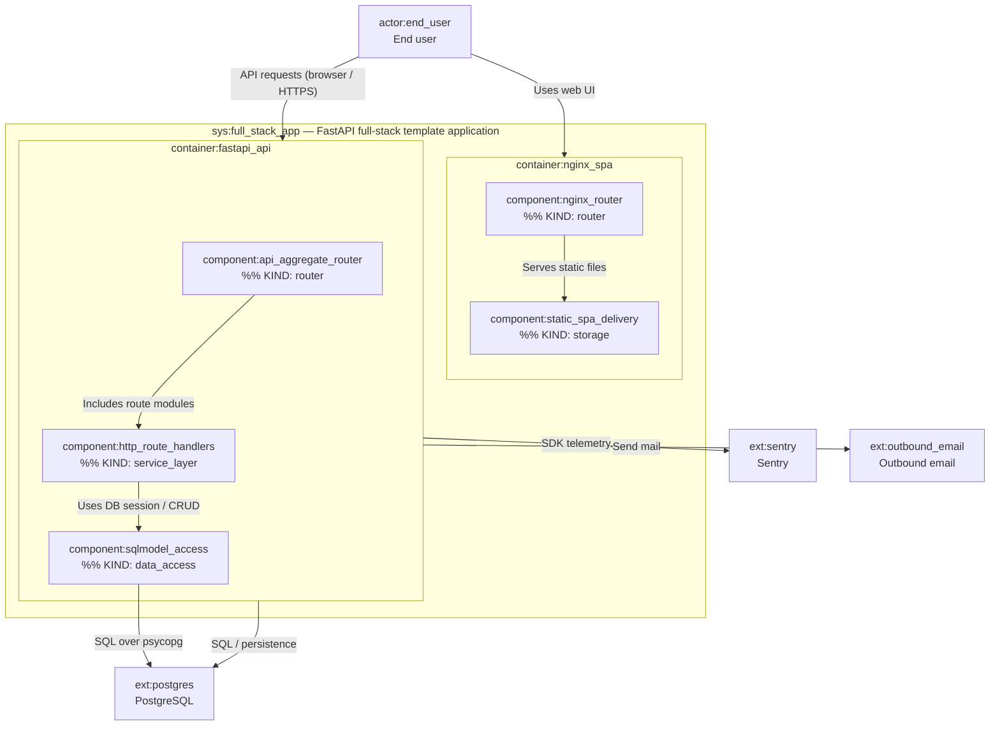

# Live C4 Preview

```mermaid
flowchart TB
  subgraph c_nginx["container:nginx_spa"]
    direction TB
    comp_nginx_router["component:nginx_router<br/>%% KIND: router"]
    comp_static["component:static_spa_delivery<br/>%% KIND: storage"]
    comp_nginx_router -->|"Serves static files"| comp_static
  end

  subgraph c_api["container:fastapi_api"]
    direction TB
    comp_agg["component:api_aggregate_router<br/>%% KIND: router"]
    comp_handlers["component:http_route_handlers<br/>%% KIND: service_layer"]
    comp_sql["component:sqlmodel_access<br/>%% KIND: data_access"]
    comp_agg -->|"Includes route modules"| comp_handlers
    comp_handlers -->|"Uses DB session / CRUD"| comp_sql
  end

  subgraph sys_wrap["sys:full_stack_app — FastAPI full-stack template application"]
    c_nginx
    c_api
  end

  actor_end_user["actor:end_user<br/>End user"]
  ext_postgres["ext:postgres<br/>PostgreSQL"]
  ext_sentry["ext:sentry<br/>Sentry"]
  ext_email["ext:outbound_email<br/>Outbound email"]

  actor_end_user -->|"Uses web UI"| c_nginx
  actor_end_user -->|"API requests (browser / HTTPS)"| c_api
  c_api -->|"SQL / persistence"| ext_postgres
  c_api -->|"SDK telemetry"| ext_sentry
  c_api -->|"Send mail"| ext_email
  comp_sql -->|"SQL over psycopg"| ext_postgres
```
