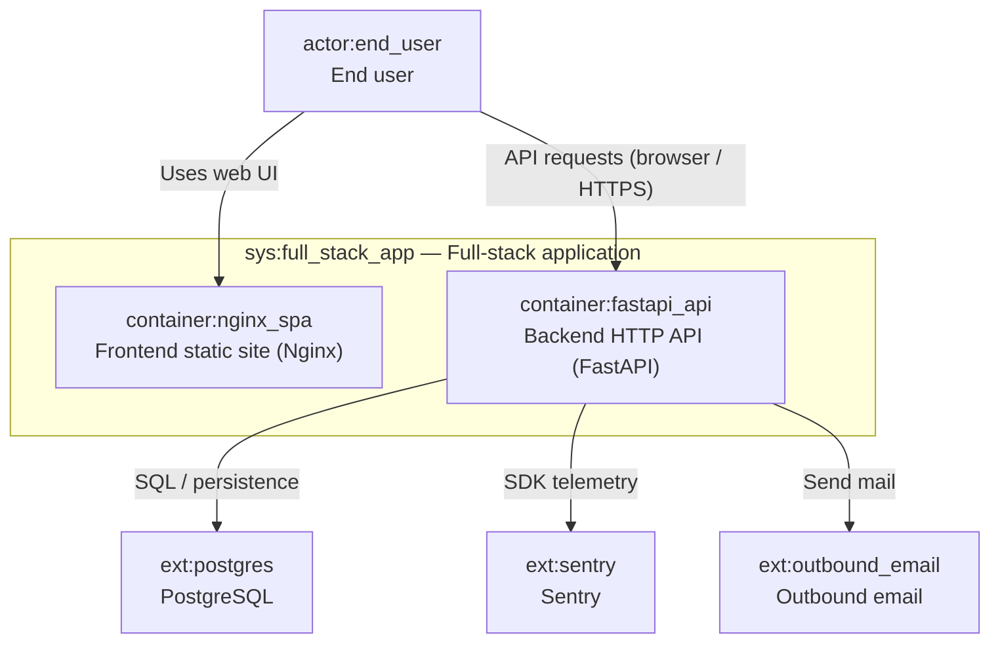

# Live C4 Preview

```mermaid
flowchart TB
  subgraph sys_full_stack["sys:full_stack_app — Full-stack application"]
    container_nginx["container:nginx_spa<br/>Frontend static site (Nginx)"]
    container_api["container:fastapi_api<br/>Backend HTTP API (FastAPI)"]
  end

  actor_end_user["actor:end_user<br/>End user"]
  ext_postgres["ext:postgres<br/>PostgreSQL"]
  ext_sentry["ext:sentry<br/>Sentry"]
  ext_email["ext:outbound_email<br/>Outbound email"]

  actor_end_user -->|"Uses web UI"| container_nginx
  actor_end_user -->|"API requests (browser / HTTPS)"| container_api
  container_api -->|"SQL / persistence"| ext_postgres
  container_api -->|"SDK telemetry"| ext_sentry
  container_api -->|"Send mail"| ext_email
```
