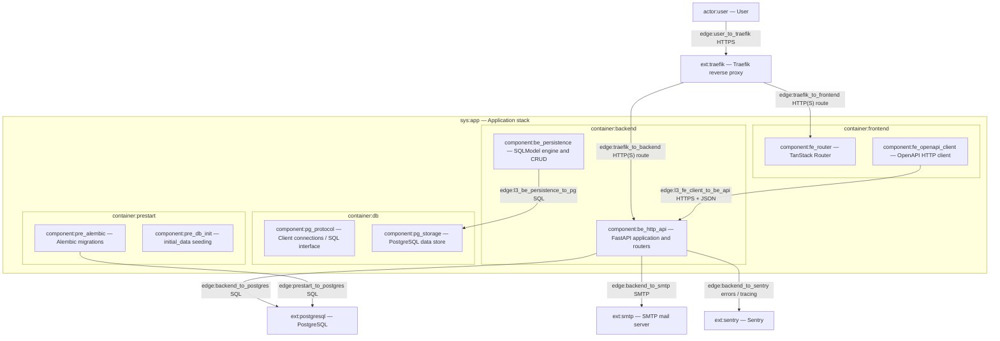

# Live C4 Preview

```mermaid
flowchart TD
  actor_user["actor:user — User"]
  ext_tr["ext:traefik — Traefik reverse proxy"]
  ext_pg["ext:postgresql — PostgreSQL"]
  ext_smtp["ext:smtp — SMTP mail server"]
  ext_sentry["ext:sentry — Sentry"]

  subgraph sys_app["sys:app — Application stack"]
    %% SCOPE: urn:c4:container:frontend
    subgraph c_fe_scope["container:frontend"]
      %% KIND: router
      fe_r["component:fe_router — TanStack Router"]
      %% KIND: integration
      fe_c["component:fe_openapi_client — OpenAPI HTTP client"]
    end
    %% SCOPE: urn:c4:container:backend
    subgraph c_be_scope["container:backend"]
      %% KIND: boundary
      be_api["component:be_http_api — FastAPI application and routers"]
      %% KIND: data_access
      be_da["component:be_persistence — SQLModel engine and CRUD"]
    end
    %% SCOPE: urn:c4:container:db
    subgraph c_db_scope["container:db"]
      %% KIND: boundary
      pg_b["component:pg_protocol — Client connections / SQL interface"]
      %% KIND: storage
      pg_s["component:pg_storage — PostgreSQL data store"]
    end
    %% SCOPE: urn:c4:container:prestart
    subgraph c_pre_scope["container:prestart"]
      %% KIND: pipeline
      pre_al["component:pre_alembic — Alembic migrations"]
      %% KIND: worker
      pre_w["component:pre_db_init — initial_data seeding"]
    end
  end

  actor_user -->|"edge:user_to_traefik HTTPS"| ext_tr
  ext_tr -->|"edge:traefik_to_frontend HTTP(S) route"| fe_r
  ext_tr -->|"edge:traefik_to_backend HTTP(S) route"| be_api
  be_api -->|"edge:backend_to_postgres SQL"| ext_pg
  be_api -->|"edge:backend_to_smtp SMTP"| ext_smtp
  be_api -->|"edge:backend_to_sentry errors / tracing"| ext_sentry
  pre_al -->|"edge:prestart_to_postgres SQL"| ext_pg
  fe_c -->|"edge:l3_fe_client_to_be_api HTTPS + JSON"| be_api
  be_da -->|"edge:l3_be_persistence_to_pg SQL"| pg_s
```
