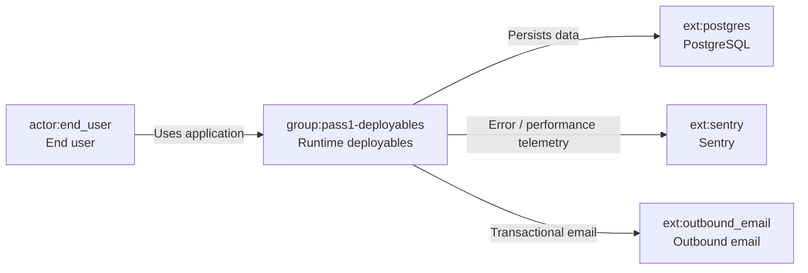

# Live C4 Preview

```mermaid
flowchart LR
  actor_end_user["actor:end_user<br/>End user"]
  group_deployables["group:pass1-deployables<br/>Runtime deployables"]
  ext_postgres["ext:postgres<br/>PostgreSQL"]
  ext_sentry["ext:sentry<br/>Sentry"]
  ext_email["ext:outbound_email<br/>Outbound email"]

  actor_end_user -->|"Uses application"| group_deployables
  group_deployables -->|"Persists data"| ext_postgres
  group_deployables -->|"Error / performance telemetry"| ext_sentry
  group_deployables -->|"Transactional email"| ext_email
```
