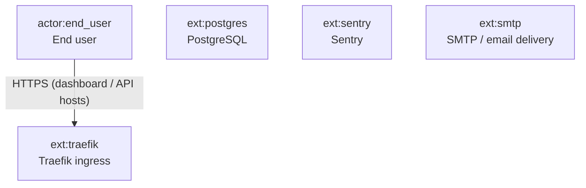

# Live C4 Preview

```mermaid
flowchart TD
  actor_end_user["actor:end_user<br/>End user"]
  ext_traefik["ext:traefik<br/>Traefik ingress"]
  ext_postgres["ext:postgres<br/>PostgreSQL"]
  ext_sentry["ext:sentry<br/>Sentry"]
  ext_smtp["ext:smtp<br/>SMTP / email delivery"]
  actor_end_user -->|"HTTPS (dashboard / API hosts)"| ext_traefik
```
