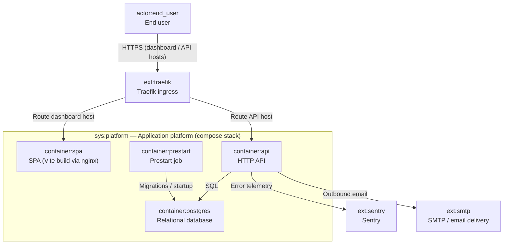

# Live C4 Preview

```mermaid
flowchart TB
  subgraph boundary["sys:platform — Application platform (compose stack)"]
    container_spa["container:spa<br/>SPA (Vite build via nginx)"]
    container_api["container:api<br/>HTTP API"]
    container_postgres["container:postgres<br/>Relational database"]
    container_prestart["container:prestart<br/>Prestart job"]
  end
  actor_end_user["actor:end_user<br/>End user"]
  ext_traefik["ext:traefik<br/>Traefik ingress"]
  ext_sentry["ext:sentry<br/>Sentry"]
  ext_smtp["ext:smtp<br/>SMTP / email delivery"]
  actor_end_user -->|"HTTPS (dashboard / API hosts)"| ext_traefik
  ext_traefik -->|"Route dashboard host"| container_spa
  ext_traefik -->|"Route API host"| container_api
  container_api -->|"SQL"| container_postgres
  container_prestart -->|"Migrations / startup"| container_postgres
  container_api -->|"Error telemetry"| ext_sentry
  container_api -->|"Outbound email"| ext_smtp
```
