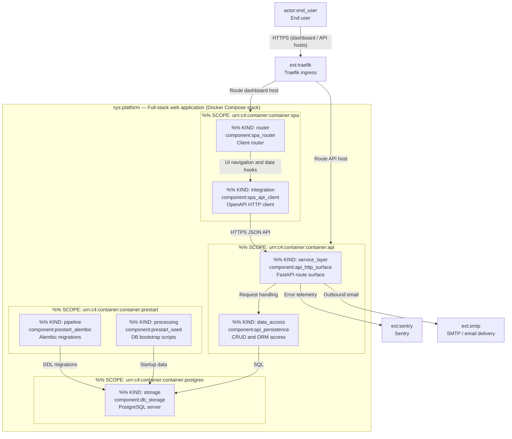

# Live C4 Preview

```mermaid
flowchart TB
  subgraph boundary["sys:platform — Full-stack web application (Docker Compose stack)"]
    subgraph spa["%% SCOPE: urn:c4:container:container:spa"]
      spa_r["%% KIND: router<br/>component:spa_router<br/>Client router"]
      spa_c["%% KIND: integration<br/>component:spa_api_client<br/>OpenAPI HTTP client"]
    end
    subgraph api["%% SCOPE: urn:c4:container:container:api"]
      api_h["%% KIND: service_layer<br/>component:api_http_surface<br/>FastAPI route surface"]
      api_p["%% KIND: data_access<br/>component:api_persistence<br/>CRUD and ORM access"]
    end
    subgraph pg["%% SCOPE: urn:c4:container:container:postgres"]
      db_s["%% KIND: storage<br/>component:db_storage<br/>PostgreSQL server"]
    end
    subgraph pre["%% SCOPE: urn:c4:container:container:prestart"]
      pre_a["%% KIND: pipeline<br/>component:prestart_alembic<br/>Alembic migrations"]
      pre_seed["%% KIND: processing<br/>component:prestart_seed<br/>DB bootstrap scripts"]
    end
  end
  actor_end_user["actor:end_user<br/>End user"]
  ext_traefik["ext:traefik<br/>Traefik ingress"]
  ext_sentry["ext:sentry<br/>Sentry"]
  ext_smtp["ext:smtp<br/>SMTP / email delivery"]
  actor_end_user -->|"HTTPS (dashboard / API hosts)"| ext_traefik
  ext_traefik -->|"Route dashboard host"| spa
  ext_traefik -->|"Route API host"| api
  spa_r -->|"UI navigation and data hooks"| spa_c
  spa_c -->|"HTTPS JSON API"| api_h
  api_h -->|"Request handling"| api_p
  api_p -->|"SQL"| db_s
  pre_a -->|"DDL migrations"| db_s
  pre_seed -->|"Startup data"| db_s
  api_h -->|"Error telemetry"| ext_sentry
  api_h -->|"Outbound email"| ext_smtp
```
