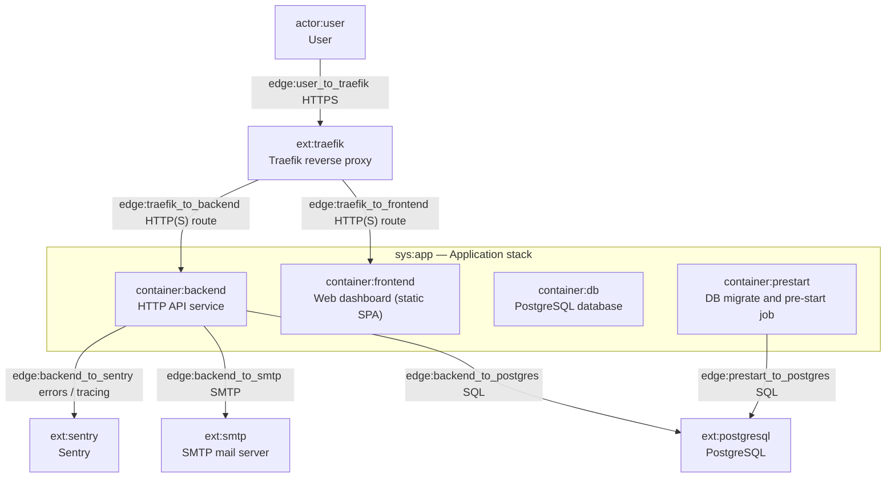

# Live C4 Preview

```mermaid
flowchart TD
  actor_user["actor:user<br/>User"]
  ext_tr["ext:traefik<br/>Traefik reverse proxy"]
  ext_pg["ext:postgresql<br/>PostgreSQL"]
  ext_smtp["ext:smtp<br/>SMTP mail server"]
  ext_sentry["ext:sentry<br/>Sentry"]

  subgraph sys_app["sys:app — Application stack"]
    c_fe["container:frontend<br/>Web dashboard (static SPA)"]
    c_be["container:backend<br/>HTTP API service"]
    c_db["container:db<br/>PostgreSQL database"]
    c_pre["container:prestart<br/>DB migrate and pre-start job"]
  end

  actor_user -->|"edge:user_to_traefik HTTPS"| ext_tr
  ext_tr -->|"edge:traefik_to_frontend HTTP(S) route"| c_fe
  ext_tr -->|"edge:traefik_to_backend HTTP(S) route"| c_be
  c_be -->|"edge:backend_to_postgres SQL"| ext_pg
  c_be -->|"edge:backend_to_smtp SMTP"| ext_smtp
  c_be -->|"edge:backend_to_sentry errors / tracing"| ext_sentry
  c_pre -->|"edge:prestart_to_postgres SQL"| ext_pg
```
