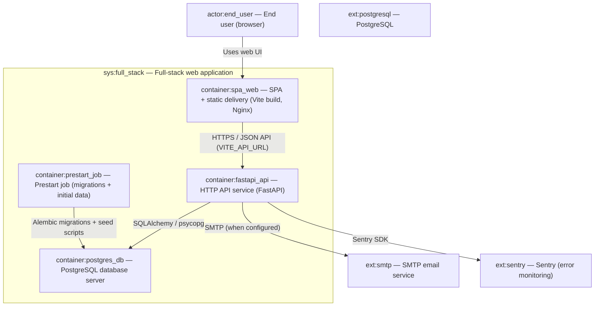

# Live C4 Preview

```mermaid
flowchart TD
  actor_end_user["actor:end_user — End user (browser)"]
  ext_pg["ext:postgresql — PostgreSQL"]
  ext_smtp["ext:smtp — SMTP email service"]
  ext_sentry["ext:sentry — Sentry (error monitoring)"]
  subgraph sys_full_stack["sys:full_stack — Full-stack web application"]
    direction TB
    %% SCOPE: urn:c4:container:sys:full_stack
    spa["container:spa_web — SPA + static delivery (Vite build, Nginx)"]
    api["container:fastapi_api — HTTP API service (FastAPI)"]
    db["container:postgres_db — PostgreSQL database server"]
    pre["container:prestart_job — Prestart job (migrations + initial data)"]
  end
  actor_end_user -->|"Uses web UI"| spa
  spa -->|"HTTPS / JSON API (VITE_API_URL)"| api
  api -->|"SQLAlchemy / psycopg"| db
  pre -->|"Alembic migrations + seed scripts"| db
  api -->|"SMTP (when configured)"| ext_smtp
  api -->|"Sentry SDK"| ext_sentry
```
