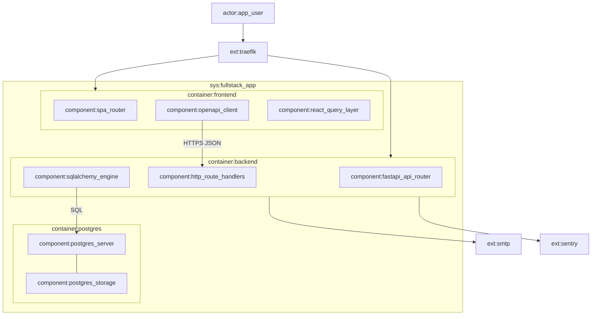

# Live C4 Preview

```mermaid
flowchart TB
  subgraph sys["sys:fullstack_app"]
    subgraph cf["container:frontend"]
      c_sp["component:spa_router"]
      c_oc["component:openapi_client"]
      c_rq["component:react_query_layer"]
    end
    subgraph cb["container:backend"]
      c_fr["component:fastapi_api_router"]
      c_hh["component:http_route_handlers"]
      c_se["component:sqlalchemy_engine"]
    end
    subgraph cp["container:postgres"]
      c_ps["component:postgres_storage"]
      c_pg["component:postgres_server"]
    end
  end
  actor_app_user["actor:app_user"]
  ext_traefik["ext:traefik"]
  ext_smtp["ext:smtp"]
  ext_sentry["ext:sentry"]
  actor_app_user --> ext_traefik
  ext_traefik --> cf
  ext_traefik --> cb
  c_oc -->|HTTPS JSON| c_hh
  c_se -->|SQL| c_pg
  cb --> ext_smtp
  cb --> ext_sentry
  c_pg --- c_ps
```
