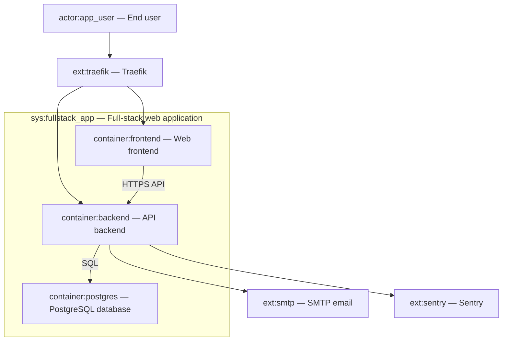

# Live C4 Preview

```mermaid
flowchart TB
  subgraph boundary["sys:fullstack_app — Full-stack web application"]
    container_frontend["container:frontend — Web frontend"]
    container_backend["container:backend — API backend"]
    container_postgres["container:postgres — PostgreSQL database"]
  end
  actor_app_user["actor:app_user — End user"]
  ext_traefik["ext:traefik — Traefik"]
  ext_smtp["ext:smtp — SMTP email"]
  ext_sentry["ext:sentry — Sentry"]
  actor_app_user --> ext_traefik
  ext_traefik --> container_frontend
  ext_traefik --> container_backend
  container_frontend -->|HTTPS API| container_backend
  container_backend -->|SQL| container_postgres
  container_backend --> ext_smtp
  container_backend --> ext_sentry
```
