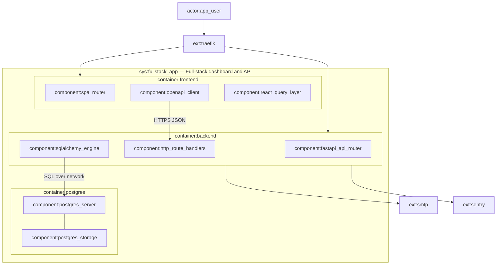

# Live C4 Preview

```mermaid
flowchart TB
  subgraph sys_fullstack_app["sys:fullstack_app — Full-stack dashboard and API"]
    subgraph ctn_frontend["container:frontend"]
      comp_spa_router["component:spa_router"]
      comp_openapi_client["component:openapi_client"]
      comp_react_query["component:react_query_layer"]
    end
    subgraph ctn_backend["container:backend"]
      comp_fastapi_router["component:fastapi_api_router"]
      comp_http_handlers["component:http_route_handlers"]
      comp_sqlalchemy["component:sqlalchemy_engine"]
    end
    subgraph ctn_postgres["container:postgres"]
      comp_pg_storage["component:postgres_storage"]
      comp_pg_server["component:postgres_server"]
    end
  end
  actor_app_user["actor:app_user"]
  ext_traefik["ext:traefik"]
  ext_smtp["ext:smtp"]
  ext_sentry["ext:sentry"]
  actor_app_user --> ext_traefik
  ext_traefik --> ctn_frontend
  ext_traefik --> ctn_backend
  comp_openapi_client -->|HTTPS JSON| comp_http_handlers
  comp_sqlalchemy -->|SQL over network| comp_pg_server
  ctn_backend --> ext_smtp
  ctn_backend --> ext_sentry
  comp_pg_server --- comp_pg_storage
```
