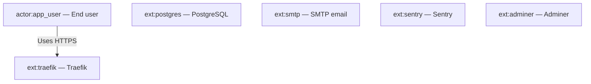

# Live C4 Preview

```mermaid
flowchart TD
  actor_app_user["actor:app_user — End user"]
  ext_traefik["ext:traefik — Traefik"]
  ext_postgres["ext:postgres — PostgreSQL"]
  ext_smtp["ext:smtp — SMTP email"]
  ext_sentry["ext:sentry — Sentry"]
  ext_adminer["ext:adminer — Adminer"]
  actor_app_user -->|Uses HTTPS| ext_traefik
```
